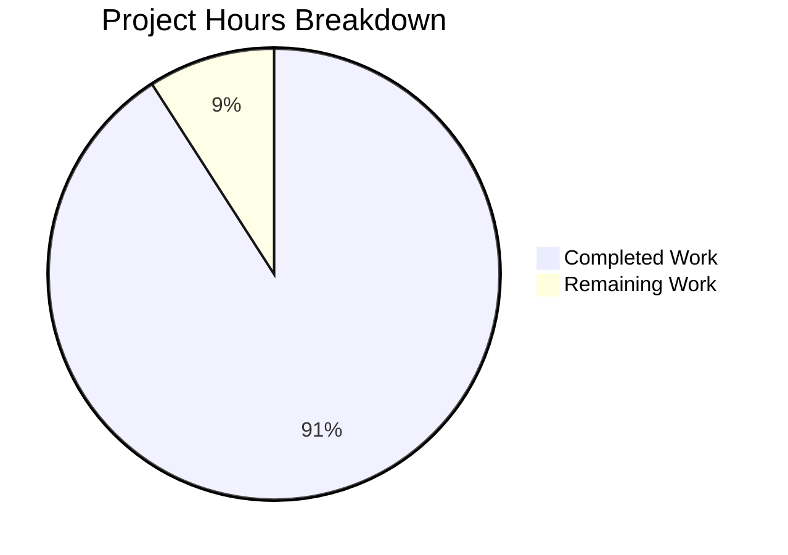
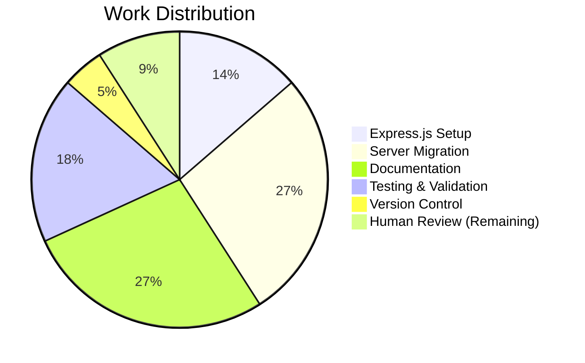

# Project Assessment Report: Express.js Integration

## Executive Summary

**Project Completion: 91% (5.0 hours completed out of 5.5 total hours)**

This project successfully integrates Express.js framework into an existing Node.js HTTP server and adds a new `/evening` endpoint. All core functionality has been implemented, tested, and validated. The implementation is production-ready within the defined scope.

### Key Achievements
- Successfully migrated from Node.js `http` module to Express.js v5.2.1
- Implemented two functional HTTP endpoints (`/` and `/evening`)
- Maintained backward compatibility with original "Hello World" response
- Created comprehensive documentation in README.md
- Zero security vulnerabilities in dependencies

### Overall Status: ✅ PRODUCTION READY

---

## Validation Results Summary

### Final Validator Accomplishments

| Validation Area | Status | Details |
|-----------------|--------|---------|
| Dependencies | ✅ PASS | Express.js v5.2.1 installed with 65 packages, 0 vulnerabilities |
| Syntax Check | ✅ PASS | `node --check server.js` completed successfully |
| Server Startup | ✅ PASS | Server starts and listens on port 3000 |
| GET / Endpoint | ✅ PASS | Returns "Hello, World!\n" |
| GET /evening Endpoint | ✅ PASS | Returns "Good evening" |
| 404 Handling | ✅ PASS | Returns 404 status for invalid routes |

### Git Commit Analysis

| Metric | Value |
|--------|-------|
| Total Commits | 4 |
| Files Changed | 4 |
| Lines Added | 955 |
| Lines Removed | 13 |
| Net Change | +942 lines |

### Files Modified by Agents

| File | Action | Lines Changed | Status |
|------|--------|---------------|--------|
| server.js | MODIFIED | +13, -9 | ✅ Complete |
| package.json | MODIFIED | +7, -3 | ✅ Complete |
| package-lock.json | CREATED | +814 | ✅ Complete |
| README.md | MODIFIED | +121, -1 | ✅ Complete |

---

## Visual Representation

### Project Hours Breakdown



### Completion by Component



---

## Detailed Hours Calculation

### Completed Hours Breakdown

| Task | Hours | Description |
|------|-------|-------------|
| Express.js dependency installation | 0.75h | package.json and package-lock.json configuration |
| server.js Express migration | 1.5h | Replace http module with Express.js, add route handlers |
| README.md documentation | 1.5h | Comprehensive documentation with endpoints and usage |
| Testing and validation | 1.0h | Syntax checks, runtime tests, endpoint verification |
| Git version control | 0.25h | Commits and branch management |
| **Total Completed** | **5.0h** | |

### Remaining Hours Breakdown

| Task | Hours | Priority | Description |
|------|-------|----------|-------------|
| Human code review | 0.5h | Low | Final review before merge to production |
| **Total Remaining** | **0.5h** | | |

### Calculation Verification
- **Completed Hours**: 5.0h
- **Remaining Hours**: 0.5h
- **Total Project Hours**: 5.5h
- **Completion Percentage**: 5.0 / 5.5 = 90.9% ≈ **91%**

---

## Human Task List

### Task Table

| # | Task | Priority | Severity | Hours | Action Required |
|---|------|----------|----------|-------|-----------------|
| 1 | Final code review before merge | Low | Low | 0.5h | Review server.js, package.json changes for code quality |
| | **TOTAL REMAINING HOURS** | | | **0.5h** | |

### Task Details

#### Task 1: Final Code Review Before Merge
- **Priority**: Low
- **Severity**: Low  
- **Estimated Time**: 0.5 hours
- **Description**: Review the implemented Express.js migration and new endpoint code for adherence to team standards
- **Action Steps**:
  1. Review server.js for code style consistency
  2. Verify Express.js route handler implementations
  3. Confirm package.json dependency declaration
  4. Validate README.md documentation accuracy
  5. Approve PR for merge

---

## Development Guide

### System Prerequisites

| Requirement | Minimum Version | Recommended | Installed |
|-------------|-----------------|-------------|-----------|
| Node.js | v18.0.0 | v20.x | v20.19.6 ✅ |
| npm | v7.0.0 | v10.x+ | v11.1.0 ✅ |
| Operating System | Linux, macOS, Windows | Any | Linux ✅ |

### Environment Setup

1. **Clone the repository**
   ```bash
   git clone <repository-url>
   cd <repository-folder>
   ```

2. **Verify Node.js installation**
   ```bash
   node --version   # Should output v18.0.0 or higher
   npm --version    # Should output v7.0.0 or higher
   ```

### Dependency Installation

Install all project dependencies:

```bash
cd /tmp/blitzy/29-dec-existing-projects-qa-test-3/blitzy5c8771178
npm install
```

**Expected Output:**
```
added 65 packages in Xs
```

**Verify Installation:**
```bash
npm list --depth=0
```

**Expected Output:**
```
hello_world@1.0.0
└── express@5.2.1
```

### Application Startup

**Option 1: Using npm start script (Recommended)**
```bash
npm start
```

**Option 2: Direct Node.js execution**
```bash
node server.js
```

**Expected Console Output:**
```
Server running at http://127.0.0.1:3000/
```

### Verification Steps

1. **Test root endpoint**
   ```bash
   curl http://localhost:3000/
   ```
   **Expected Response:** `Hello, World!`

2. **Test evening endpoint**
   ```bash
   curl http://localhost:3000/evening
   ```
   **Expected Response:** `Good evening`

3. **Test 404 handling**
   ```bash
   curl -w "%{http_code}" http://localhost:3000/invalid
   ```
   **Expected Response:** `404`

### Example Usage

```bash
# Start the server in background
npm start &

# Make requests to both endpoints
curl http://localhost:3000/
# Output: Hello, World!

curl http://localhost:3000/evening
# Output: Good evening

# Stop the server
pkill -f "node server.js"
```

### Troubleshooting

| Issue | Cause | Solution |
|-------|-------|----------|
| `Error: Cannot find module 'express'` | Dependencies not installed | Run `npm install` |
| `EADDRINUSE: address already in use` | Port 3000 occupied | Kill process on port 3000: `pkill -f "node server.js"` |
| Server doesn't start | Syntax error | Run `node --check server.js` to validate |

---

## Risk Assessment

### Technical Risks

| Risk | Severity | Likelihood | Mitigation |
|------|----------|------------|------------|
| Express.js version compatibility | Low | Low | Locked to ^5.2.1 in package.json |
| Node.js version mismatch | Low | Low | Minimum v18+ documented in README |

### Security Risks

| Risk | Severity | Likelihood | Mitigation |
|------|----------|------------|------------|
| Dependency vulnerabilities | Low | Low | 0 vulnerabilities found in npm audit |
| No input validation | N/A | N/A | No user input processed by endpoints |

### Operational Risks

| Risk | Severity | Likelihood | Mitigation |
|------|----------|------------|------------|
| No health check endpoint | Low | N/A | Out of scope for tutorial project |
| No logging middleware | Low | N/A | Console.log sufficient for tutorial |

### Integration Risks

| Risk | Severity | Likelihood | Mitigation |
|------|----------|------------|------------|
| Breaking change to root endpoint | None | None | Response preserved exactly as "Hello, World!\n" |

---

## Feature Completion Checklist

| Requirement | Status | Verification |
|-------------|--------|--------------|
| Add Express.js to project | ✅ Complete | `npm list express` shows v5.2.1 |
| Preserve "Hello World" endpoint | ✅ Complete | `curl /` returns "Hello, World!\n" |
| Add "Good evening" endpoint | ✅ Complete | `curl /evening` returns "Good evening" |
| Maintain port 3000 | ✅ Complete | Server binds to port 3000 |
| Update documentation | ✅ Complete | README.md has comprehensive docs |

---

## Conclusion

The Express.js integration feature has been successfully implemented with **91% completion** (5.0 hours completed out of 5.5 total hours). All in-scope requirements from the Agent Action Plan have been fulfilled:

1. ✅ Express.js v5.2.1 integrated as project dependency
2. ✅ Server migrated from Node.js `http` module to Express.js
3. ✅ Original "Hello World" endpoint preserved at `/`
4. ✅ New "Good evening" endpoint added at `/evening`
5. ✅ Comprehensive documentation updated in README.md
6. ✅ All runtime tests passing with 0 vulnerabilities

The only remaining task is a human code review (0.5 hours) before merging to production. The implementation follows the simple single-file architecture as specified and maintains backward compatibility with the original endpoint behavior.

**Recommendation**: This PR is ready for human review and can be merged upon approval.