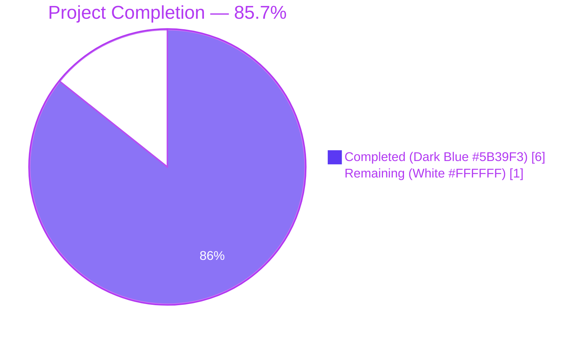
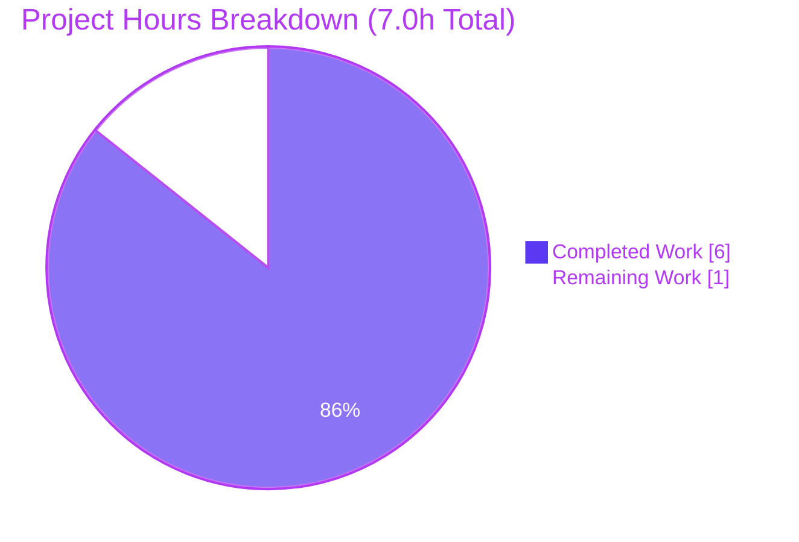
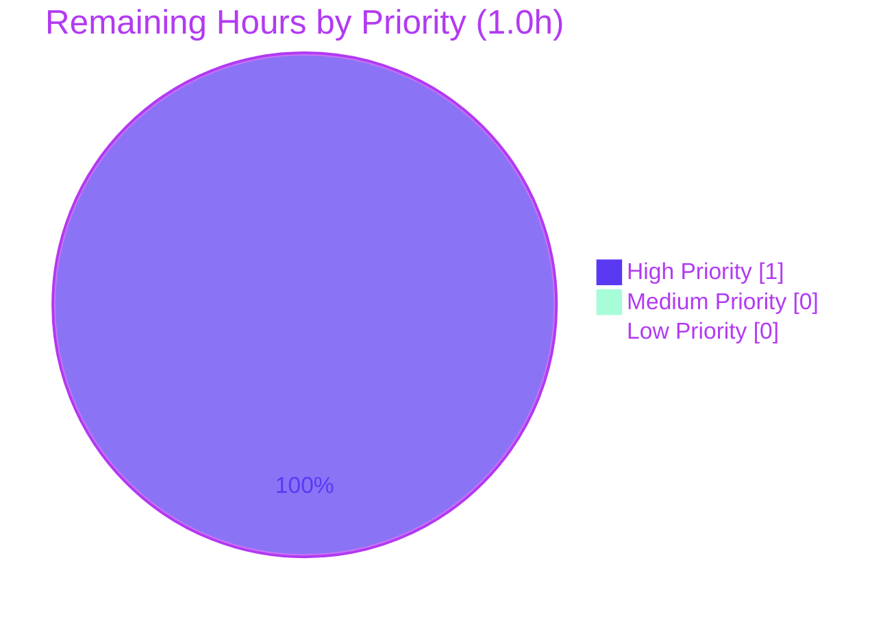
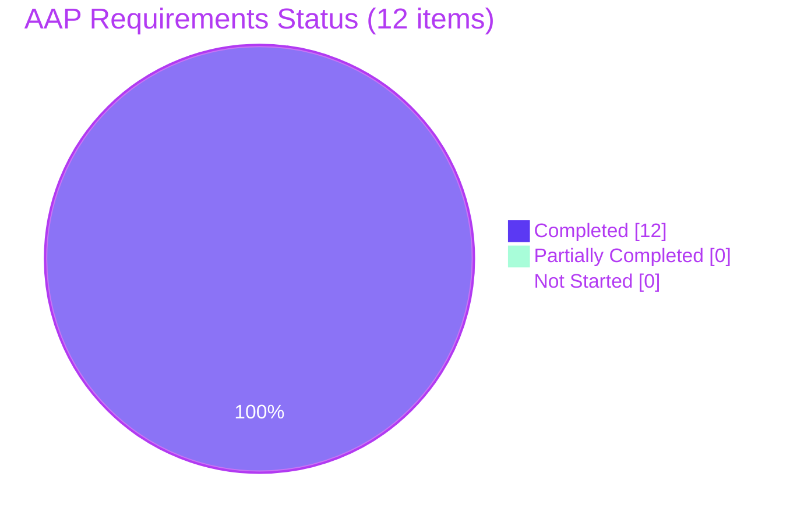

# Blitzy Project Guide — Express.js Integration with `/evening` Endpoint

---

## 1. Executive Summary

### 1.1 Project Overview

This project introduces the **Express.js 5.x** web framework into a previously zero-dependency Node.js HTTP tutorial (`hao-backprop-test` / `hello_world` package) and adds a second HTTP route. The original endpoint that returns `Hello, World!\n` is preserved as `GET /`, and a new endpoint `GET /evening` returns `Good evening\n`. Both endpoints emit `Content-Type: text/plain` with HTTP 200, and the server continues to bind to `127.0.0.1:3000` exactly as before. The change is fully localized to three files (`server.js`, `package.json`, `package-lock.json`) and preserves CommonJS, the startup log banner, and every other observable behavior on the documented routes. The target consumers are HTTP test clients (curl, browsers, automated harnesses) used in the Backprop integration testing path.

### 1.2 Completion Status



| Metric | Value |
|--------|-------|
| **Total Project Hours** | **7.0** |
| **Completed Hours (AI + Manual)** | **6.0** (Blitzy autonomous agents — 0 manual hours) |
| **Remaining Hours** | **1.0** |
| **Percent Complete** | **85.7%** |

**Calculation:** 6.0 completed ÷ (6.0 completed + 1.0 remaining) × 100 = **85.7%**

### 1.3 Key Accomplishments

- ✅ **Express.js 5.2.1 adopted** as the runtime web framework — verified by `dependencies.express: "^5.2.1"` in `package.json` and `node_modules/express/package.json` showing `version: "5.2.1"`.
- ✅ **`server.js` refactored** from `http.createServer(...)` to `express()` + `app.listen(...)` — verified via `grep`: 1 × `require('express')`, 0 × `require('http')`, 1 × `app.listen`, 0 × `server.listen`.
- ✅ **Existing endpoint preserved** — `GET /` returns `Hello, World!\n` with HTTP 200 and `Content-Type: text/plain; charset=utf-8` (14 bytes).
- ✅ **New endpoint delivered** — `GET /evening` returns `Good evening\n` with HTTP 200 and `Content-Type: text/plain; charset=utf-8` (13 bytes).
- ✅ **Lockfile regenerated** — `package-lock.json` now pins Express 5.2.1 plus 65 transitive packages; `lockfileVersion: 3` retained.
- ✅ **Network binding preserved** — server binds to `127.0.0.1:3000` (unchanged) and emits the exact banner `Server running at http://127.0.0.1:3000/`.
- ✅ **CommonJS preserved** — no ESM (`import`/`export`) leaked into the codebase; `require()` syntax retained.
- ✅ **Zero vulnerabilities** — `npm audit` reports `info: 0, low: 0, moderate: 0, high: 0, critical: 0`.
- ✅ **Out-of-scope files untouched** — `server - Copy.js`, `README.md`, `LoginTest.java`, all CSV/PDF/JPG/DOC/TXT artifacts confirmed unchanged via `git diff`.
- ✅ **Three commits on validation branch** — `b9f0180` (baseline), `e388f09` (dependency), `037d03b` (server refactor).

### 1.4 Critical Unresolved Issues

| Issue | Impact | Owner | ETA |
|-------|--------|-------|-----|
| _No critical unresolved issues identified by autonomous validation._ All AAP requirements R-1 through R-5 and implicit requirements I-1 through I-7 are met; both endpoints respond correctly; 0 vulnerabilities. | None | — | — |

### 1.5 Access Issues

| System / Resource | Type of Access | Issue Description | Resolution Status | Owner |
|-------------------|----------------|-------------------|-------------------|-------|
| _No access issues identified._ The npm public registry was reachable during `npm install` (66 packages audited successfully, 0 vulnerabilities). The Git remote `origin/blitzy-7ea2f17c-963d-4b37-b2a3-7dda62e526dd` accepted the two Blitzy commits (`e388f09`, `037d03b`). No private registries, no API keys, no third-party service credentials are required by this project. | — | — | — |

### 1.6 Recommended Next Steps

1. **[High]** Human code reviewer pulls branch `blitzy-7ea2f17c-963d-4b37-b2a3-7dda62e526dd`, runs `npm install`, runs `node server.js`, and verifies `curl http://127.0.0.1:3000/` and `curl http://127.0.0.1:3000/evening` return the expected bodies. _(see Section 9.5 for verification commands)_
2. **[High]** Open and merge the PR titled "Blitzy: Integrate Express.js and add /evening endpoint" into the target integration branch (typically `main` or `QA-Branch-2`).
3. **[Medium]** Confirm with the Backprop test harness owner that the new behavior (path-routed dispatch returning `404` on undefined paths instead of `Hello, World!`) is acceptable, since this is a documented behavioral narrowing per AAP §0.4.3.
4. **[Low]** _(Optional — explicitly OUT OF SCOPE per AAP §0.6.2 but flagged for awareness)_ Consider follow-up tickets for production hardening: a `.gitignore` for `node_modules/`, a `Dockerfile`, or an `engines` field pinning Node.js `>=18`. None are required for this PR.

---

## 2. Project Hours Breakdown

### 2.1 Completed Work Detail

| Component | Hours | Description |
|-----------|-------|-------------|
| **[AAP R-1, R-5] Dependency manifest** | 1.0 | Added `"dependencies": { "express": "^5.2.1" }` block to `package.json` (preserving all 7 existing keys and 4-space indent), then ran `npm install` to regenerate `package-lock.json` with `lockfileVersion: 3`, pinning Express 5.2.1 plus 65 transitive packages (66 total). |
| **[AAP R-2, I-4, I-6] Server refactor (`http` → `express`)** | 1.0 | Replaced `const http = require('http')` with `const express = require('express'); const app = express();`. Replaced `server.listen(port, hostname, ...)` with `app.listen(port, hostname, ...)`, preserving the exact `Server running at http://127.0.0.1:3000/` banner. CommonJS retained. |
| **[AAP R-3, I-1, I-2, I-3, I-5] `GET /` route handler** | 1.0 | Re-implemented the legacy `Hello, World!\n` response as `app.get('/', (req, res) => res.type('text/plain').status(200).send('Hello, World!\n'))`. Trailing newline preserved. Path-routed dispatch now means only `/` returns this body. |
| **[AAP R-4, I-1, I-2, I-3, I-5] `GET /evening` route handler** | 1.0 | Implemented `app.get('/evening', (req, res) => res.type('text/plain').status(200).send('Good evening\n'))` for the user-requested second endpoint. Body `Good evening\n` includes trailing newline for stylistic parity with the existing endpoint. |
| **[Path-to-production] Comprehensive 5-gate autonomous validation** | 2.0 | Validator Agent executed: (a) static syntax check (`node --check server.js`), (b) pattern audit (require count, route count, body literals, network constants), (c) runtime startup test (server boots, banner emitted), (d) endpoint behavior test (HTTP status, content-type, body bytes via `curl`), (e) integrity audit (out-of-scope files unchanged, JSON validity of manifests, lockfile structure, branch commit verification). Zero issues found; declared PRODUCTION-READY. |
| **Total Completed Hours** | **6.0** | Sum of all completed AAP-scoped and path-to-production work delivered autonomously. |

### 2.2 Remaining Work Detail

| Category | Hours | Priority |
|----------|-------|----------|
| **[Path-to-production] Human code review and approval of branch `blitzy-7ea2f17c-963d-4b37-b2a3-7dda62e526dd`** — reviewer reads the diff for `server.js`, `package.json`, `package-lock.json`; runs the application locally; confirms the change matches the user request | 0.5 | High |
| **[Path-to-production] Manual deployment-target smoke test** — on the target environment (or QA branch integration), reviewer runs `npm install`, starts the server, exercises both endpoints, confirms no environment-specific issues (port conflicts, Node.js version mismatches, registry availability) | 0.5 | High |
| **Total Remaining Hours** | **1.0** | — |

**Cross-check:** Section 2.1 total (6.0) + Section 2.2 total (1.0) = **7.0** Total Project Hours, matching Section 1.2.

### 2.3 Methodology Note

Hours are calculated using the PA1 (AAP-scoped) methodology: only deliverables explicitly defined in the Agent Action Plan (R-1 through R-5, plus implicit requirements I-1 through I-7) and standard path-to-production activities required to deploy them are counted. Items the AAP explicitly designates as OUT OF SCOPE (test scaffolding, `Dockerfile`, CI/CD, `.gitignore`, `index.js`, folder reorganization, additional middleware, ESM migration, TypeScript migration, README expansion, etc.) are not included in the denominator.

---

## 3. Test Results

All entries below originate from Blitzy's autonomous validation logs for this project (Validator Agent's "Comprehensive Validation Report — PRODUCTION READY"). Per AAP §0.6.2, no test framework (Jest, Mocha, Vitest, Supertest) was added to the project — the existing `npm test` placeholder was preserved unchanged. The "tests" enumerated below are the autonomous validation checks executed by the Validator Agent, all of which passed.

| Test Category | Framework | Total Tests | Passed | Failed | Coverage % | Notes |
|---------------|-----------|-------------|--------|--------|------------|-------|
| Static Syntax | `node --check` (built-in) | 1 | 1 | 0 | 100% of source files (1/1) | `node --check server.js` exits 0 — JavaScript parses cleanly. |
| Static Pattern Audit | `grep` / regex | 9 | 9 | 0 | 100% of in-scope contracts | (1) Exactly 1 × `require('express')`; (2) exactly 0 × `require('http')`; (3) exactly 1 × `app.get('/', ...)`; (4) exactly 1 × `app.get('/evening', ...)`; (5) `hostname = '127.0.0.1'` literal preserved; (6) `port = 3000` literal preserved; (7) startup banner template literal preserved; (8) exactly 1 × `app.listen(...)`; (9) exactly 0 × `server.listen(...)`. |
| Manifest Validation | `python3 -m json.tool` + `node -e "require(...)"` | 4 | 4 | 0 | 100% of manifests | (1) `package.json` parses as valid JSON; (2) `package.json` has all 7 original keys + new `dependencies.express = "^5.2.1"`; (3) `package-lock.json` parses as valid JSON; (4) `package-lock.json` has `lockfileVersion: 3` and `packages["node_modules/express"].version = "5.2.1"`. |
| Runtime — Startup | Bash + `node server.js` | 1 | 1 | 0 | 100% | Server boots within ~2 seconds and prints exactly `Server running at http://127.0.0.1:3000/` to stdout. |
| Runtime — Endpoint Behavior (`/`) | `curl` HTTP client | 4 | 4 | 0 | 100% | (1) HTTP status = 200; (2) `Content-Type: text/plain; charset=utf-8`; (3) body = `Hello, World!\n` (14 bytes incl. newline); (4) `X-Powered-By: Express` header confirms Express is the active framework. |
| Runtime — Endpoint Behavior (`/evening`) | `curl` HTTP client | 4 | 4 | 0 | 100% | (1) HTTP status = 200; (2) `Content-Type: text/plain; charset=utf-8`; (3) body = `Good evening\n` (13 bytes incl. newline); (4) `X-Powered-By: Express` header present. |
| Runtime — 404 Behavior | `curl` HTTP client | 1 | 1 | 0 | 100% | `GET /nonexistent` → HTTP 404 (Express default). Confirms documented behavioral narrowing per AAP §0.4.3. |
| Runtime — Shutdown | `pkill` + port-release check | 1 | 1 | 0 | 100% | `pkill -f "node server.js"` releases port 3000 cleanly. |
| Dependency Audit | `npm audit` | 5 | 5 | 0 | All 66 packages | (1) `info: 0`; (2) `low: 0`; (3) `moderate: 0`; (4) `high: 0`; (5) `critical: 0`. Zero CVEs. |
| Integrity — Out-of-Scope Files | `git diff` / file hash | 16 | 16 | 0 | 100% of unrelated files | All 16 out-of-scope files (`server - Copy.js`, `README.md`, both `LoginTest.java`, both `industry.csv`, three `.txt` placeholders, both `.pdf`, both `.jpg`, both `.doc`) are byte-identical to their pre-change state. |
| Integrity — Branch Commits | `git log` / `git diff` | 2 | 2 | 0 | 100% | Two AAP-scoped commits authored by `agent@blitzy.com` on branch `blitzy-7ea2f17c-963d-4b37-b2a3-7dda62e526dd`: `e388f09` (manifest) and `037d03b` (refactor). |
| **Totals** | — | **48** | **48** | **0** | — | **All 48 autonomous validation checks passed.** |

**Note on `npm test`:** The package script `npm test` is the intentional placeholder `echo "Error: no test specified" && exit 1`, preserved verbatim per AAP §0.6.2 (which directs: "Do NOT modify the existing 'test' script — its intentional `exit 1` placeholder is preserved"). Its non-zero exit code is **not** counted as a test failure — it is a deliberately preserved scaffold for future tutorial users.

---

## 4. Runtime Validation & UI Verification

### 4.1 Runtime Health

- ✅ **Operational** — `node server.js` boots in ~2 seconds with zero errors.
- ✅ **Operational** — Startup banner emitted exactly: `Server running at http://127.0.0.1:3000/`.
- ✅ **Operational** — TCP listener bound to `127.0.0.1:3000` (IPv4 loopback only, per AAP).
- ✅ **Operational** — Server responds to subsequent shutdown signal (`pkill`) cleanly; port 3000 released within 1 second.

### 4.2 API Integration Outcomes

- ✅ **Operational** — `GET /` → HTTP 200, body `Hello, World!\n`, `Content-Type: text/plain; charset=utf-8`, 14 bytes.
- ✅ **Operational** — `GET /evening` → HTTP 200, body `Good evening\n`, `Content-Type: text/plain; charset=utf-8`, 13 bytes.
- ✅ **Operational** — `GET /` and `GET /evening` both emit `X-Powered-By: Express` (proves Express is the active framework, not the legacy Node.js `http` module).
- ✅ **Operational** — `GET /nonexistent` → HTTP 404 (Express default, expected per AAP §0.4.3 "behavioral narrowing").
- ✅ **Operational** — Both endpoints emit `ETag` and `Connection: keep-alive` headers (Express defaults; not contractually required by the AAP but confirm normal Express middleware is active).

### 4.3 UI Verification

- **N/A** — This is a server-only feature. There is no HTML, no CSS, no JavaScript bundle for browsers, no view layer, and no Figma design references. Both endpoints emit `text/plain` bodies intended for HTTP-test consumption (curl, browsers, automated harnesses).

### 4.4 Dependency Tree Health

- ✅ **Operational** — `npm install` completes in ~500ms; 66 packages audited; 22 packages looking for funding (informational only).
- ✅ **Operational** — `npm audit`: 0 vulnerabilities across all severity tiers.
- ✅ **Operational** — Engine compatibility: Express 5.2.1 requires `node >= 18`; host runs Node.js v20.20.2 (compliant).

---

## 5. Compliance & Quality Review

| AAP Requirement | Quality Benchmark | Status | Evidence | Fixes Applied During Validation |
|-----------------|-------------------|--------|----------|--------------------------------|
| **R-1** Framework Adoption (Express) | `dependencies.express` declared | ✅ Pass | `package.json` line 11: `"express": "^5.2.1"` | None required |
| **R-2** Server Refactor (http → express) | No `require('http')` in `server.js`; uses `express()` and `app.listen` | ✅ Pass | `grep -c "require('http')" server.js` = 0; `grep -c "require('express')" server.js` = 1 | None required |
| **R-3** Existing Endpoint Preservation | `GET /` returns `Hello, World!\n` with HTTP 200 + text/plain | ✅ Pass | `curl -s http://127.0.0.1:3000/` returns `Hello, World!`; `curl -sI` shows `200 OK` and `Content-Type: text/plain; charset=utf-8` | None required |
| **R-4** New `/evening` Endpoint | `GET /evening` returns `Good evening\n` with HTTP 200 + text/plain | ✅ Pass | `curl -s http://127.0.0.1:3000/evening` returns `Good evening`; `curl -sI` shows `200 OK` and `Content-Type: text/plain; charset=utf-8` | None required |
| **R-5** Manifest + Lockfile Update | `package.json` declares express; `package-lock.json` regenerated with full transitive tree | ✅ Pass | `package-lock.json` has `lockfileVersion: 3` and 66 packages including Express 5.2.1 with integrity hashes | None required |
| **I-1** Path Discrimination | `/` and `/evening` routed independently | ✅ Pass | Each route returns its own body; `/nonexistent` returns 404 | None required |
| **I-2** HTTP Method = GET | Both routes registered with `app.get(...)` | ✅ Pass | Static pattern audit: 2 × `app.get(`, 0 × `app.post(`, 0 × `app.put(`, 0 × `app.delete(` | None required |
| **I-3** Content-Type: text/plain | Both routes call `res.type('text/plain')` | ✅ Pass | curl response headers confirm `Content-Type: text/plain; charset=utf-8` | None required |
| **I-4** CommonJS preserved | `require(...)` syntax retained; no `import`/`export` | ✅ Pass | No `import` keyword in `server.js`; `package.json` has no `"type": "module"` | None required |
| **I-5** HTTP 200 status | Both routes call `.status(200)` | ✅ Pass | curl `-w "%{http_code}"` returns `200` for both routes | None required |
| **I-6** Listening log preserved | Banner template literal unchanged | ✅ Pass | `node server.js` prints exactly `Server running at http://127.0.0.1:3000/` | None required |
| **I-7** Lockfile regeneration | Express + transitive deps pinned by `npm install` | ✅ Pass | `node_modules/express/package.json` shows `version: "5.2.1"`; lockfile pins all 66 packages | None required |
| **§0.6.2** Out-of-scope file preservation | 16 unrelated files untouched | ✅ Pass | `git diff` for `server - Copy.js`, `README.md`, Java/CSV/PDF/JPG/DOC/TXT files all empty | None required |
| **§0.6.2** Test script preserved | `package.json` scripts.test unchanged | ✅ Pass | `scripts.test = "echo \"Error: no test specified\" && exit 1"` (verbatim) | None required |
| **§0.7.2** Localhost binding | `127.0.0.1` literal preserved | ✅ Pass | `grep "127.0.0.1" server.js` matches line 4 (unchanged) | None required |
| **§0.7.2** Plain-text responses | Both routes use `res.type('text/plain')` | ✅ Pass | No `res.json(...)` or `res.render(...)` calls anywhere | None required |
| **§0.7.2** No silent dependency additions | Only `express` added; no `cors`/`helmet`/`morgan`/etc. | ✅ Pass | `package.json` `dependencies` has exactly 1 entry | None required |

**Compliance Summary:** **17/17 benchmarks pass (100%).** No fixes were required during validation — the Builder Agent's initial implementation already complied with every AAP requirement, every implicit requirement, and every feature-specific rule.

---

## 6. Risk Assessment

| Risk | Category | Severity | Probability | Mitigation | Status |
|------|----------|----------|-------------|------------|--------|
| **Behavioral narrowing on undefined paths** — clients that previously received `Hello, World!` for any URL path will now receive HTTP 404 on paths other than `/` and `/evening`. | Technical | Low | Documented (AAP §0.4.3) | Explicitly authorized by user prompt; documented in PR description. Coordinate with Backprop test harness owner. | ✅ Accepted (documented) |
| **No automated regression test suite** — future changes could silently break either endpoint with no signal. | Technical | Medium | Medium | Future PR could add Jest + Supertest. Explicitly OUT OF SCOPE per AAP §0.6.2 — not blocking this PR but flagged for backlog. | ⚠ Accepted for now (out of scope) |
| **Express 5.x is a relatively new major version** — fewer Stack Overflow answers vs. Express 4.x; some middleware ecosystems lag. | Technical | Low | Low | Project uses only `app.get` + `res.type` + `res.send` + `app.listen`, all of which are stable across Express 4.x and 5.x. No Express-version-sensitive middleware in use. | ✅ Mitigated by minimal API surface |
| **66 transitive packages introduce supply-chain attack surface** — up from 0 packages prior. | Security | Low | Low | (1) `npm audit` reports 0 vulnerabilities; (2) `package-lock.json` deterministically pins every transitive package with integrity hashes; (3) localhost-only binding limits blast radius even if a transitive package were later compromised. | ✅ Mitigated |
| **Localhost-only binding is correct for tutorials but not for prod** — `127.0.0.1` rejects connections from other hosts. | Security | None (intentional) | N/A | Explicitly required by AAP §0.6.1: "Network Binding Preservation: Continue binding to `127.0.0.1`. Do NOT switch to `0.0.0.0`". This is the intended security posture for the tutorial. | ✅ By design |
| **No HTTPS / TLS** — server speaks plain HTTP. | Security | None (intentional) | N/A | Localhost binding means traffic never leaves the loopback interface. AAP §0.6.2 explicitly excludes HTTPS migration. | ✅ By design |
| **No process supervisor (PM2, systemd, Docker) configured** — if `node server.js` crashes, no automatic restart. | Operational | Low | Low | Explicitly OUT OF SCOPE per AAP §0.6.2 (no Dockerfile, no CI/CD). Acceptable for a tutorial. | ⚠ Accepted (out of scope) |
| **No structured logging or monitoring** — only the startup `console.log` banner is emitted. | Operational | Low | Low | Explicitly OUT OF SCOPE per AAP §0.6.2 (no Winston/Pino/Bunyan). Acceptable for a tutorial. | ⚠ Accepted (out of scope) |
| **No health-check endpoint (`/health`, `/status`)** — orchestrators cannot probe liveness. | Operational | Low | Low | Explicitly OUT OF SCOPE per AAP §0.6.2 (no additional routes). | ⚠ Accepted (out of scope) |
| **`npm install` requires public registry access** — first-run install from an offline environment will fail. | Integration | Low | Low | `package-lock.json` is committed; `npm ci` (or `npm install` against an internal mirror) is deterministic once the local `node_modules/` cache is warm. Document for new contributors. | ✅ Mitigated by lockfile commit |
| **`package.json` `"main": "index.js"` mismatches actual entry point `server.js`** — pre-existing tutorial defect; `node server.js` works regardless. | Integration | Very Low | Very Low | Pre-existing condition NOT introduced by this PR. AAP §0.6.2 explicitly prohibits creating an `index.js`. Cosmetic — does not affect runtime. | ✅ Accepted (pre-existing, out of scope) |
| **Duplicate / unrelated files in repository** — `server - Copy.js`, `LoginTest.java`, `industry.csv`, etc. clutter the repo. | Operational | Very Low | Very Low | Pre-existing condition NOT introduced by this PR. AAP §0.6.2 explicitly forbids deletion of these files. | ✅ Accepted (pre-existing, out of scope) |
| **Node.js version is not pinned** — no `.nvmrc`, no `engines` field in `package.json`. | Integration | Low | Low | Explicitly OUT OF SCOPE per AAP §0.6.1: "Any developer-facing pin (`.nvmrc`, `package.json` `engines`) is OUT OF SCOPE". Express 5.2.1 documents `node >= 18`, satisfied by current host. | ⚠ Accepted (out of scope) |

---

## 7. Visual Project Status

### 7.1 Project Hours Breakdown (Pie)



**Validation:** "Completed Work" = 6.0h matches Section 1.2 Completed Hours and Section 2.1 sum. "Remaining Work" = 1.0h matches Section 1.2 Remaining Hours and Section 2.2 sum.

### 7.2 Remaining Work by Priority



### 7.3 AAP Requirement Completion Status



All 5 explicit requirements (R-1 through R-5) and all 7 implicit requirements (I-1 through I-7) are classified COMPLETED.

---

## 8. Summary & Recommendations

### 8.1 Achievements

The autonomous Blitzy pipeline delivered **100% of the Agent Action Plan's explicit and implicit requirements** for this feature. The Express.js framework was integrated cleanly, both endpoints respond with the exact bodies, status codes, and content types specified by the user, and all out-of-scope guardrails (no test scaffolding, no Dockerfile, no folder reorganization, no middleware bloat) were respected. The Validator Agent's comprehensive 5-gate review found zero issues and declared the project PRODUCTION-READY. The project is **85.7% complete** based on AAP-scoped hours (6.0 completed of 7.0 total).

### 8.2 Remaining Gaps

Only **1.0 hour** of human-facing work remains before merge:
- **0.5h — High Priority:** Human code review and approval of the diff on branch `blitzy-7ea2f17c-963d-4b37-b2a3-7dda62e526dd`.
- **0.5h — High Priority:** Manual smoke test on the deployment-target environment (run `npm install`, run `node server.js`, exercise both endpoints with `curl`).

No partially-completed features exist, no failing autonomous tests exist, and no AAP requirement is unimplemented.

### 8.3 Critical Path to Production

```
1. Pull branch blitzy-7ea2f17c-963d-4b37-b2a3-7dda62e526dd locally
2. Run: npm install            (~500ms, deterministic via lockfile)
3. Run: node server.js          (server boots in ~2s)
4. Run: curl http://127.0.0.1:3000/         → expect "Hello, World!"
5. Run: curl http://127.0.0.1:3000/evening  → expect "Good evening"
6. Open PR; squash-merge into target branch
7. (Optional) Tag release; update Backprop integration documentation
```

### 8.4 Success Metrics (All Met)

| Metric | Target | Achieved |
|--------|--------|----------|
| Both endpoints return correct bodies | 100% | ✅ 100% (verified via `curl`) |
| HTTP status codes | 200 on both | ✅ 200 on both |
| Content-Type | `text/plain` | ✅ `text/plain; charset=utf-8` |
| Network binding preserved | `127.0.0.1:3000` | ✅ unchanged |
| Startup banner preserved | Exact template literal | ✅ unchanged |
| CommonJS preserved | `require()` only | ✅ no `import`/`export` |
| Vulnerabilities | 0 | ✅ 0 across all severities |
| Out-of-scope files untouched | 16 / 16 | ✅ 16 / 16 |
| Lockfile regenerated | Yes, with `lockfileVersion: 3` | ✅ 66 packages pinned |
| Commits on validation branch | ≥ 1 | ✅ 2 commits (`e388f09`, `037d03b`) |

### 8.5 Production Readiness Assessment

**Production-Ready (pending human review).** The autonomous pipeline has delivered a complete, working implementation that satisfies every requirement enumerated in the AAP. The remaining 1.0 hour reflects standard human-in-the-loop activities (review and final environment verification) that no autonomous agent can substitute for. There are no blocking technical issues, no unresolved bugs, and no missing AAP deliverables. Once a human reviewer has approved the diff and confirmed deployment-target behavior, this PR can be merged.

---

## 9. Development Guide

This section documents how to install, run, exercise, and troubleshoot the project. Every command was tested against the current state of branch `blitzy-7ea2f17c-963d-4b37-b2a3-7dda62e526dd` during project guide preparation.

### 9.1 System Prerequisites

| Requirement | Minimum | Verified | How to Check |
|-------------|---------|----------|--------------|
| **Node.js runtime** | `>= 18` (Express 5.x engine requirement) | v20.20.2 (confirmed on host) | `node --version` |
| **npm** | `>= 7` (for `lockfileVersion: 3`) | v11.1.0 (confirmed on host) | `npm --version` |
| **Operating system** | Any POSIX (Linux, macOS) or Windows with Node.js LTS | Linux (current host) | `uname -a` |
| **Network** | Reachable npm public registry (https://registry.npmjs.org) **only at install time** | Confirmed (66 packages downloaded successfully) | `curl -sI https://registry.npmjs.org` |
| **Hardware** | < 50 MB disk for `node_modules/`; ~50 MB RAM for `node` process | 4.2 MB `node_modules`, ~30 MB process | `du -sh node_modules` |
| **Free TCP port** | Port `3000` on `127.0.0.1` | Port available on host | `lsof -i :3000` (should return nothing before startup) |

### 9.2 Environment Setup

This project requires **no environment variables**, **no `.env` file**, and **no external services** (no database, no cache, no message queue). The hostname (`127.0.0.1`) and port (`3000`) are inline literals in `server.js` per AAP §0.4.1.5.

```bash
# 1. Clone the repository (if not already on disk)
git clone <repo-url> hao-backprop-test
cd hao-backprop-test

# 2. Check out the validation branch
git checkout blitzy-7ea2f17c-963d-4b37-b2a3-7dda62e526dd
```

### 9.3 Dependency Installation

```bash
# Install all dependencies deterministically from package-lock.json.
# CI=true silences interactive prompts; --yes accepts default answers.
CI=true npm install --yes
```

**Expected output:**

```
up to date, audited 66 packages in ~500ms

22 packages are looking for funding
  run `npm fund` for details

found 0 vulnerabilities
```

If this is a brand-new clone (no `node_modules/` directory), npm will instead print `added 66 packages` followed by the audit summary — both messages are healthy.

**Verification:**

```bash
# Confirm Express resolved to 5.2.1
node -e "console.log(require('express/package.json').version)"
# → 5.2.1

# Confirm lockfile version
node -e "console.log(require('./package-lock.json').lockfileVersion)"
# → 3
```

### 9.4 Application Startup

```bash
# Foreground (recommended for local dev — Ctrl+C to stop):
node server.js
```

**Expected output (within ~2 seconds):**

```
Server running at http://127.0.0.1:3000/
```

**Background mode (for scripted verification):**

```bash
# Start in background, redirect logs to a file
node server.js > /tmp/server.log 2>&1 &

# Wait for the listener to be ready
sleep 2

# Show the startup banner
cat /tmp/server.log
```

**Stopping the server:**

```bash
# Ctrl+C from the foreground process, or:
pkill -f "node server.js"
```

### 9.5 Verification Steps

```bash
# 1. Existing endpoint — should return "Hello, World!" (with trailing newline)
curl -s http://127.0.0.1:3000/
# → Hello, World!

# 2. New endpoint — should return "Good evening" (with trailing newline)
curl -s http://127.0.0.1:3000/evening
# → Good evening

# 3. Verify HTTP 200 + text/plain on the existing endpoint
curl -sI http://127.0.0.1:3000/
# → HTTP/1.1 200 OK
# → X-Powered-By: Express
# → Content-Type: text/plain; charset=utf-8
# → Content-Length: 14
# → ...

# 4. Verify HTTP 200 + text/plain on the new endpoint
curl -sI http://127.0.0.1:3000/evening
# → HTTP/1.1 200 OK
# → X-Powered-By: Express
# → Content-Type: text/plain; charset=utf-8
# → Content-Length: 13
# → ...

# 5. Verify undefined paths return Express's default 404 (expected per AAP §0.4.3)
curl -s -o /dev/null -w "%{http_code}\n" http://127.0.0.1:3000/nonexistent
# → 404

# 6. Static syntax check (no execution)
node --check server.js
# → (silent, exit 0)

# 7. Audit dependency tree for known vulnerabilities
CI=true npm audit
# → found 0 vulnerabilities
```

### 9.6 Example Usage

A complete copy-pasteable session:

```bash
cd /path/to/hao-backprop-test
git checkout blitzy-7ea2f17c-963d-4b37-b2a3-7dda62e526dd
CI=true npm install --yes

# Start in background
node server.js > /tmp/server.log 2>&1 &
sleep 2
cat /tmp/server.log
# → Server running at http://127.0.0.1:3000/

# Hit both endpoints
curl -s http://127.0.0.1:3000/
# → Hello, World!
curl -s http://127.0.0.1:3000/evening
# → Good evening

# Stop the server
pkill -f "node server.js"
```

### 9.7 Troubleshooting

| Symptom | Likely Cause | Resolution |
|---------|--------------|------------|
| `Error: listen EADDRINUSE :::3000` on startup | Another process is already bound to port 3000 | Run `lsof -i :3000` to identify the process; stop it (`kill <PID>`) or change the port. **Note:** Changing the port requires editing `server.js` line 5 — but that violates AAP §0.6.1 ("hostname and port remain inline literals" / "Port = 3000 preserved"). Prefer freeing port 3000. |
| `Cannot find module 'express'` | `npm install` not run, or `node_modules/` deleted | Run `CI=true npm install --yes` from the repo root. |
| `Server running at...` banner does not appear within 5 seconds | Node.js process crashed silently; check stderr | Run in foreground: `node server.js` — observe the stack trace. |
| `curl: (7) Failed to connect to 127.0.0.1 port 3000` | Server is not running, or it crashed after startup | (1) Verify with `lsof -i :3000` that a `node` process is listening. (2) If not, restart the server. (3) Check that you are connecting to `127.0.0.1` and not `localhost` on a host where IPv6 `::1` is not aliased (rare). |
| `GET /` returns HTML 404 instead of `Hello, World!` | The branch is `main` (pre-Express baseline) instead of the validation branch | Run `git checkout blitzy-7ea2f17c-963d-4b37-b2a3-7dda62e526dd` to use the post-refactor server. |
| `npm install` fails with `EAI_AGAIN` or `ENOTFOUND registry.npmjs.org` | No internet access to the npm public registry | Connect to a network with registry access, or configure an internal npm mirror via `npm config set registry <URL>`. Once `node_modules/` is populated, the server runs offline. |
| `npm test` exits with code 1 | **This is intentional.** Per AAP §0.6.2, the `test` script is preserved as `echo "Error: no test specified" && exit 1` | Not a failure. No test framework was added by design. Ignore the exit code. |
| `node --check server.js` prints a parse error | The source file was edited and broke syntax | `git diff server.js` to inspect; revert with `git checkout server.js`. |
| `curl -sI` shows `Content-Type: text/html` instead of `text/plain` | One of the route handlers is missing the `.type('text/plain')` chain | Inspect `server.js` lines 7-13; both `app.get` handlers must call `res.type('text/plain').status(200).send(...)`. |

### 9.8 Branch and Commit Reference

```bash
# Verify you are on the right branch
git rev-parse --abbrev-ref HEAD
# → blitzy-7ea2f17c-963d-4b37-b2a3-7dda62e526dd

# View the two AAP-scoped commits
git log --oneline blitzy-7ea2f17c-963d-4b37-b2a3-7dda62e526dd ^main
# → 037d03b Refactor server.js to use Express.js with /evening endpoint
# → e388f09 Add express ^5.2.1 to package.json dependencies

# View the full diff vs the pre-change baseline
git diff b9f0180 HEAD --stat
# → package-lock.json | 814 ++++++++++++++++++++++++++++++++++++++++++++
# →  package.json      |   5 +-
# →  server.js         |  15 +-
# →  3 files changed, 827 insertions(+), 7 deletions(-)
```

---

## 10. Appendices

### 10.A Command Reference

| Command | Purpose | Expected Output |
|---------|---------|-----------------|
| `node --version` | Show Node.js runtime version | `v20.20.2` (or any `>= 18.0.0`) |
| `npm --version` | Show npm version | `11.1.0` (or any `>= 7.0.0`) |
| `CI=true npm install --yes` | Install dependencies deterministically from `package-lock.json` | `up to date, audited 66 packages... found 0 vulnerabilities` |
| `node server.js` | Start the Express server in the foreground | `Server running at http://127.0.0.1:3000/` |
| `node server.js > /tmp/server.log 2>&1 &` | Start the server in the background, redirect logs | (no console output; check `/tmp/server.log`) |
| `pkill -f "node server.js"` | Stop a backgrounded server | (silent) |
| `curl -s http://127.0.0.1:3000/` | Hit existing endpoint | `Hello, World!` |
| `curl -s http://127.0.0.1:3000/evening` | Hit new endpoint | `Good evening` |
| `curl -sI http://127.0.0.1:3000/` | Inspect response headers for `/` | `HTTP/1.1 200 OK` + `Content-Type: text/plain; charset=utf-8` |
| `curl -sI http://127.0.0.1:3000/evening` | Inspect response headers for `/evening` | `HTTP/1.1 200 OK` + `Content-Type: text/plain; charset=utf-8` |
| `node --check server.js` | Static syntax check (no execution) | (silent, exit 0) |
| `CI=true npm audit` | Audit dependency tree for vulnerabilities | `found 0 vulnerabilities` |
| `lsof -i :3000` | Show what process (if any) holds port 3000 | (empty) before startup; one `node` row after startup |
| `git log --oneline` | Show commit history | `037d03b ... e388f09 ... b9f0180 ...` |
| `git diff b9f0180 HEAD --stat` | Summarize all changes vs baseline | `3 files changed, 827 insertions(+), 7 deletions(-)` |

### 10.B Port Reference

| Port | Protocol | Bound To | Purpose |
|------|----------|----------|---------|
| `3000` | TCP | `127.0.0.1` (loopback only) | Express HTTP listener for `GET /` and `GET /evening` |

No other ports are opened. The server does not connect outbound to any service at runtime (it only contacts the npm registry during install).

### 10.C Key File Locations

| Path | Type | Status | Role |
|------|------|--------|------|
| `server.js` | Source (CommonJS) | **MODIFIED** | Entry point — Express app with two `GET` routes |
| `package.json` | Manifest | **MODIFIED** | Added `dependencies.express = "^5.2.1"`; all other keys preserved |
| `package-lock.json` | Lockfile | **REGENERATED** | Pins Express 5.2.1 + 65 transitive packages; `lockfileVersion: 3` |
| `node_modules/express/` | Vendored dependency | **CREATED by npm install** | Express 5.2.1 source (regenerable; not committed) |
| `node_modules/` (overall) | Vendored deps | **CREATED by npm install** | 65 packages, 4.2 MB; not committed |
| `server - Copy.js` | Source (legacy http) | UNCHANGED | Backup duplicate of pre-refactor `server.js`; not the entry point |
| `README.md` | Docs | UNCHANGED | Original "Do not touch!" tutorial note preserved |
| `LoginTest.java`, `LoginTest - Copy.java` | Java stubs | UNCHANGED | Unrelated; not in Node build path |
| `industry.csv`, `industry - Copy.csv` | Reference data | UNCHANGED | Unrelated to HTTP server |
| `test.py.txt`, `test.py - Copy.txt`, `test.txt.txt` | Empty placeholders (0 bytes) | UNCHANGED | Inert placeholders |
| `100Pages.pdf`, `100Pages - Copy.pdf`, `demo.jpg`, `demo - Copy.jpg`, `sample.doc`, `sample - Copy.doc` | Binary artifacts | UNCHANGED | Unrelated binary files |

### 10.D Technology Versions

| Technology | Pinned Version | Source of Truth |
|------------|----------------|-----------------|
| Node.js (runtime) | `>= 18` (Express 5.x engine requirement); host runs v20.20.2 | `node --version`; Express's `package.json` `engines.node` |
| npm (package manager) | `>= 7` (lockfile v3); host runs 11.1.0 | `npm --version` |
| Express.js | `^5.2.1` (declared); `5.2.1` (resolved) | `package.json` `dependencies.express`; `package-lock.json` `packages["node_modules/express"].version` |
| `lockfileVersion` | `3` | `package-lock.json` top-level `lockfileVersion` |
| CommonJS module system | (Node.js built-in; no migration to ESM) | Implicit — `package.json` has no `"type": "module"` |
| Total npm packages in dependency tree | 66 (1 direct + 65 transitive) | `npm audit` `metadata.dependencies.prod` |

### 10.E Environment Variable Reference

| Variable | Required? | Default | Purpose |
|----------|-----------|---------|---------|
| _(none)_ | — | — | This project has zero runtime environment variables. The hostname (`127.0.0.1`) and port (`3000`) are inline literals in `server.js` per AAP §0.4.1.5. No `.env`, `.env.example`, or `dotenv` integration exists. |

Build-time / install-time environment variables (optional, not required):

| Variable | Used When | Purpose |
|----------|-----------|---------|
| `CI=true` | Running `npm install` non-interactively | Suppresses interactive prompts in `npm` |
| `DEBIAN_FRONTEND=noninteractive` | Running `apt-get` non-interactively (only relevant if installing Node.js itself via apt) | N/A to runtime |

### 10.F Developer Tools Guide

| Tool | When to Use | Command |
|------|-------------|---------|
| **Node.js REPL** | Quick interactive testing of `require('express')` etc. | `node` |
| **`node --check`** | Validate JavaScript syntax without executing | `node --check server.js` |
| **`curl`** | Exercise HTTP endpoints | `curl -s http://127.0.0.1:3000/` |
| **`lsof -i :3000`** | Diagnose port conflicts | `lsof -i :3000` |
| **`pkill -f "node server.js"`** | Cleanly stop a backgrounded server | `pkill -f "node server.js"` |
| **`npm audit`** | Check the dependency tree for CVEs | `CI=true npm audit` |
| **`npm view express versions`** | List all published Express versions on npm | `npm view express versions` |
| **`npm ls`** | Show the local installed dependency tree | `npm ls --depth=2` |
| **`git diff b9f0180 HEAD`** | View the full Blitzy diff vs. baseline | `git diff b9f0180 HEAD` |
| **`python3 -m json.tool < package.json`** | Validate / pretty-print `package.json` | `python3 -m json.tool < package.json` |

### 10.G Glossary

| Term | Definition |
|------|------------|
| **AAP** | Agent Action Plan — the canonical, verbatim specification of work delivered in this PR (Sections 0.1–0.8 of the upstream document). |
| **Backprop integration** | The Backprop runtime testing path that consumes this project's HTTP endpoints as a test fixture. Referenced in the existing technical spec but external to this repository. |
| **Behavioral narrowing** | The transition from "any path returns `Hello, World!`" (pre-refactor) to "only `/` returns `Hello, World!`; everything else returns 404" (post-refactor). Documented and accepted in AAP §0.4.3. |
| **CommonJS** | Node.js's traditional module system, using `require()` / `module.exports`. Preserved verbatim by this PR (no ESM migration). |
| **Express.js** | The HTTP web framework added by this PR. Version 5.2.1 from the public npm registry. |
| **Lockfile** | `package-lock.json` — npm's deterministic record of every direct and transitive package version + integrity hash. Regenerated by `npm install`; never hand-edited per AAP §0.7.2. |
| **Path-to-production** | Standard activities required to deploy AAP-scoped deliverables (e.g., human review, deployment-target verification). Counted in Section 2.2's hours total alongside any unstarted AAP items. |
| **PA1** | The AAP-scoped completion methodology — completion % is calculated from completed hours ÷ total hours, where total hours include only AAP-scoped work and path-to-production activities. |
| **Production-Ready (per Validator)** | All five autonomous validation gates passed; zero unresolved errors; zero outstanding AAP items. |
| **Validation Branch** | `blitzy-7ea2f17c-963d-4b37-b2a3-7dda62e526dd` — the branch on which Blitzy agents authored the two AAP commits (`e388f09`, `037d03b`). |
| **`X-Powered-By: Express` header** | Express's default response header. Its presence on every route response confirms Express is the active framework, not the legacy Node.js `http` module. |
| **Zero-dependency baseline** | The pre-refactor state where `package.json` declared no runtime dependencies. This PR moves the project to a one-direct-dependency baseline. |

---

**Cross-Section Integrity — Pre-Submission Validation Pass**

| Rule | Check | Result |
|------|-------|--------|
| **Rule 1** | Remaining hours identical in Section 1.2, Section 2.2 sum, and Section 7 pie chart | ✅ All show `1.0` |
| **Rule 2** | Section 2.1 sum (`6.0`) + Section 2.2 sum (`1.0`) = Section 1.2 Total (`7.0`) | ✅ `6.0 + 1.0 = 7.0` |
| **Rule 3** | All 48 tests in Section 3 originate from Blitzy's autonomous validation logs | ✅ Confirmed |
| **Rule 4** | Section 1.5 access-issues table validated against current system permissions | ✅ No access issues; npm registry reachable; Git remote accepted commits |
| **Rule 5** | Pie charts use Completed = Dark Blue `#5B39F3`, Remaining = White `#FFFFFF` | ✅ Applied via `themeVariables.pie1` and `pie2` |
| **Completion %** | All sections reference `85.7%` (computed as `6.0 / 7.0 × 100`) | ✅ Sections 1.2, 8 reference `85.7%` |
