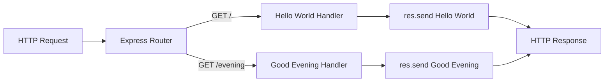
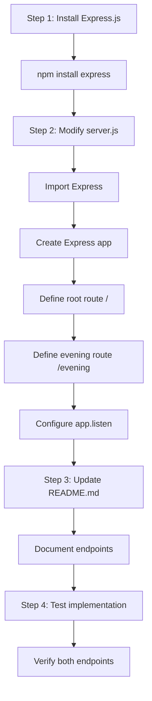
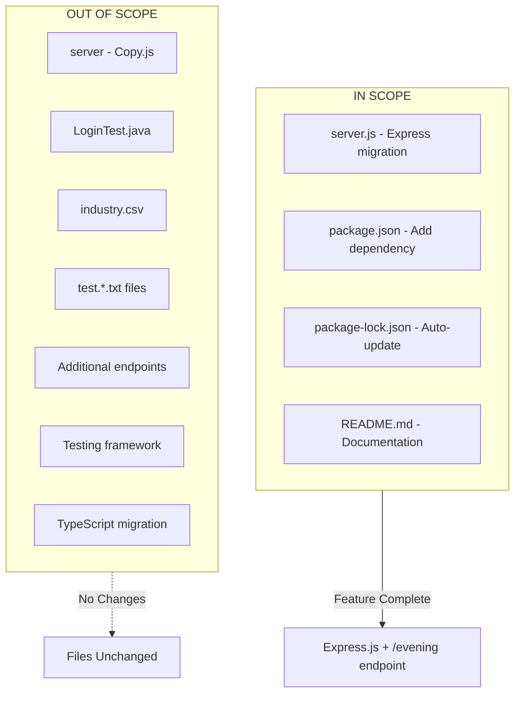

# Technical Specification

# 0. Agent Action Plan

## 0.1 Intent Clarification

This section captures and transforms the user's requirements into precise technical specifications for adding Express.js framework integration and a new API endpoint to the existing Node.js HTTP server.

### 0.1.1 Core Feature Objective

Based on the prompt, the Blitzy platform understands that the new feature requirement is to:

- **Integrate Express.js Framework**: Replace or augment the existing built-in Node.js `http` module implementation with Express.js web framework to provide a more robust routing infrastructure
- **Add New "Good Evening" Endpoint**: Create a new HTTP endpoint that returns the response "Good evening" when accessed
- **Preserve Existing Functionality**: Maintain the existing "Hello world" endpoint behavior to ensure backward compatibility

**Implicit Requirements Detected:**
- The existing server binding configuration (hostname `127.0.0.1`, port `3000`) should be preserved
- The response format should remain consistent (text/plain content type)
- The CommonJS module system (`require()`) should be maintained for consistency with the existing codebase
- The zero-dependency characteristic of the project will change to include Express.js and its transitive dependencies

**Feature Dependencies and Prerequisites:**
- Node.js runtime v18+ (current: v20.x) - Express.js 5.x requires Node.js 18 or higher
- npm package manager for dependency installation
- Network access to npm registry for package installation

### 0.1.2 Special Instructions and Constraints

**Architectural Requirements:**
- Follow the existing CommonJS module pattern (`const express = require('express')`)
- Maintain the single-file server architecture in `server.js`
- Keep the server binding to the same hostname and port configuration

**User Example (preserved exactly as provided):**
> "this is a tutorial of node js server hosting one endpoint that returns the response "Hello world". Could you add expressjs into the project and add another endpoint that return the response of "Good evening"?"

**Web Search Requirements Documented:**
- Express.js latest stable version verification: **v5.2.1** (confirmed via npm registry)
- Express.js 5.x requires Node.js 18+ (compatible with project's Node.js v20.x)
- Express.js 5.0 was released October 15, 2024, with security improvements and promise support

### 0.1.3 Technical Interpretation

These feature requirements translate to the following technical implementation strategy:

| Requirement | Technical Action | Target Component |
|-------------|------------------|------------------|
| Add Express.js | Install Express.js as project dependency | `package.json`, `package-lock.json` |
| Create "Good evening" endpoint | Define new GET route handler | `server.js` |
| Preserve "Hello world" endpoint | Convert existing logic to Express route | `server.js` |
| Framework migration | Replace `http.createServer()` with `express()` app | `server.js` |

**Implementation Approach:**
- To **integrate Express.js**, we will **install** the `express` package and **modify** `server.js` to use Express application factory
- To **add the "Good evening" endpoint**, we will **create** a new Express route handler at a designated path (e.g., `/evening`)
- To **preserve the "Hello world" endpoint**, we will **convert** the existing response logic to an Express route handler at the root path (`/`)


## 0.2 Repository Scope Discovery

This section provides a comprehensive analysis of all repository files that need modification, creation, or consideration for the Express.js integration feature.

### 0.2.1 Comprehensive File Analysis

**Existing Repository Structure:**

| File | Type | Status | Relevance to Feature |
|------|------|--------|---------------------|
| `server.js` | JavaScript | MODIFY | Primary server implementation - requires Express.js migration |
| `server - Copy.js` | JavaScript | NO CHANGE | Backup file - preserve as reference |
| `package.json` | JSON | MODIFY | Add Express.js dependency |
| `package-lock.json` | JSON | AUTO-UPDATE | Will be regenerated by npm install |
| `README.md` | Markdown | MODIFY | Update documentation for new endpoint |
| `LoginTest.java` | Java | OUT OF SCOPE | Unrelated test stub |
| `LoginTest - Copy.java` | Java | OUT OF SCOPE | Unrelated test stub copy |
| `industry.csv` | CSV | OUT OF SCOPE | Data file - unrelated |
| `industry - Copy.csv` | CSV | OUT OF SCOPE | Data file copy - unrelated |
| `test.py.txt` | Text | OUT OF SCOPE | Empty placeholder |
| `test.py - Copy.txt` | Text | OUT OF SCOPE | Empty placeholder copy |
| `test.txt.txt` | Text | OUT OF SCOPE | Empty placeholder |

**Files Requiring Modification:**

| File Path | Current State | Required Changes |
|-----------|---------------|------------------|
| `server.js` | Uses `http.createServer()` with single response | Convert to Express.js app with two route handlers |
| `package.json` | No dependencies listed | Add `express` as dependency |
| `package-lock.json` | Only root package metadata | Will be auto-generated with Express.js and transitive dependencies |
| `README.md` | Basic project description | Add Express.js usage and endpoint documentation |

### 0.2.2 Integration Point Discovery

**API Endpoints Analysis:**

| Current Endpoint | Path | Method | Response | Change Required |
|-----------------|------|--------|----------|-----------------|
| Hello World | `/*` (catch-all) | ALL | "Hello, World!\n" | Convert to Express GET route at `/` |
| Good Evening | N/A | N/A | N/A | CREATE new Express GET route |

**Server Configuration Touchpoints:**

| Configuration | File Location | Current Value | After Migration |
|---------------|---------------|---------------|-----------------|
| Hostname | `server.js:3` | `127.0.0.1` | `127.0.0.1` (preserved) |
| Port | `server.js:4` | `3000` | `3000` (preserved) |
| Content-Type | `server.js:8` | `text/plain` | `text/plain` (Express default for `res.send()`) |

### 0.2.3 Web Search Research Conducted

**Research Areas Investigated:**

| Topic | Finding | Source |
|-------|---------|--------|
| Express.js Latest Version | v5.2.1 | npm registry |
| Node.js Compatibility | Express 5.x requires Node.js 18+ | Express.js GitHub releases |
| Express.js 5.0 Release | Released October 15, 2024 | Express.js official changelog |
| Security Updates | Includes CVE-2024-45590 mitigation | Express.js GitHub releases |

### 0.2.4 New File Requirements

**New Source Files to Create:** None required - the Express.js integration can be implemented within the existing `server.js` file to maintain the simple single-file architecture.

**New Test Files:** Not in scope for this feature addition. The project currently has no test framework configured.

**New Configuration Files:** None required - Express.js configuration can be inline in `server.js`.

**Modified Files Summary:**

| File | Action | Purpose |
|------|--------|---------|
| `server.js` | MODIFY | Implement Express.js server with two endpoints |
| `package.json` | MODIFY | Add Express.js dependency declaration |
| `package-lock.json` | AUTO-UPDATE | Lock Express.js and transitive dependency versions |
| `README.md` | MODIFY | Document new endpoint and Express.js usage |


## 0.3 Dependency Inventory

This section documents all private and public packages relevant to the Express.js feature addition, including new dependencies and import updates required.

### 0.3.1 Private and Public Packages

**Current Dependencies (Before Feature):**

| Package Registry | Name | Version | Purpose |
|-----------------|------|---------|---------|
| Node.js Built-in | `http` | N/A (bundled) | HTTP server creation |

**New Dependencies (After Feature):**

| Package Registry | Name | Version | Purpose |
|-----------------|------|---------|---------|
| npm (public) | `express` | ^5.2.1 | Web framework for HTTP server and routing |

**Express.js Transitive Dependencies:**

Express.js 5.x brings the following key transitive dependencies (automatically managed by npm):

| Package | Purpose | Version Range |
|---------|---------|---------------|
| `body-parser` | Request body parsing middleware | ^2.1.0 |
| `content-type` | Parse Content-Type header | ^1.0.5 |
| `cookie` | HTTP cookie handling | ^0.7.0 |
| `debug` | Debug logging utility | ^4.4.0 |
| `finalhandler` | Final HTTP response handling | ^2.1.0 |
| `qs` | Query string parsing | ^6.14.0 |
| `router` | Express routing engine | ^2.2.0 |
| `send` | Static file serving | ^1.1.0 |
| `serve-static` | Serve static files | ^2.2.0 |

### 0.3.2 Dependency Updates

**Package.json Modifications:**

| Field | Before | After |
|-------|--------|-------|
| `dependencies` | (not present) | `{ "express": "^5.2.1" }` |
| `main` | `"index.js"` | `"server.js"` (correction to match actual entry point) |
| `scripts.start` | (not present) | `"node server.js"` (recommended addition) |

**Import Updates Required:**

Files requiring import changes:

| File Pattern | Current Import | New Import | Transformation |
|--------------|----------------|------------|----------------|
| `server.js` | `const http = require('http');` | `const express = require('express');` | Replace Node.js http with Express |

**Import Transformation Rules:**

```javascript
// Old (current implementation)
const http = require('http');

// New (Express.js implementation)
const express = require('express');
```

### 0.3.3 External Reference Updates

**Configuration Files to Update:**

| File | Change Required |
|------|-----------------|
| `package.json` | Add `dependencies` object with Express.js |
| `package-lock.json` | Auto-generated by `npm install` |

**Documentation Updates:**

| File | Change Required |
|------|-----------------|
| `README.md` | Add Express.js installation and endpoint documentation |

**Build/Deployment Files:** None present in repository - no changes required.

**CI/CD Files:** None present in repository - no changes required.

### 0.3.4 Version Compatibility Matrix

| Component | Required Version | Installed Version | Status |
|-----------|------------------|-------------------|--------|
| Node.js | >=18.0.0 | 20.19.6 | ✅ Compatible |
| npm | >=7.0.0 | 11.1.0 | ✅ Compatible |
| Express.js | ^5.2.1 | To be installed | ✅ Will install |

**Installation Command:**
```bash
npm install express@^5.2.1
```


## 0.4 Integration Analysis

This section identifies all existing code touchpoints that require modification to integrate Express.js and the new endpoint.

### 0.4.1 Existing Code Touchpoints

**Direct Modifications Required:**

| File | Location | Current Code | Modification Description |
|------|----------|--------------|-------------------------|
| `server.js` | Line 1 | `const http = require('http');` | Replace with Express.js import |
| `server.js` | Lines 3-4 | Hostname and port constants | Preserve but simplify usage |
| `server.js` | Lines 6-10 | `http.createServer()` callback | Replace with Express route handlers |
| `server.js` | Lines 12-14 | `server.listen()` call | Convert to Express `app.listen()` |

**Code Section Analysis:**

| Section | Lines | Current Purpose | New Purpose |
|---------|-------|-----------------|-------------|
| Module Import | 1 | Import Node.js http module | Import Express.js |
| Configuration | 3-4 | Define hostname and port | Define port (hostname optional in Express) |
| Server Creation | 6-10 | Create HTTP server with callback | Create Express app with route handlers |
| Server Binding | 12-14 | Start listening on port | Start Express app listening |

### 0.4.2 Integration Point Mapping

**Request Handling Flow - Before (Node.js http):**


**Request Handling Flow - After (Express.js):**



### 0.4.3 API Route Integration

**Route Definition Matrix:**

| Route Path | HTTP Method | Handler Function | Response Body |
|------------|-------------|------------------|---------------|
| `/` | GET | Root handler | "Hello, World!\n" |
| `/evening` | GET | Evening handler | "Good evening" |

**Route Handler Specifications:**

| Handler | Request Processing | Response Format |
|---------|-------------------|-----------------|
| Root (`/`) | No request body processing | Plain text response |
| Evening (`/evening`) | No request body processing | Plain text response |

### 0.4.4 Dependency Injection Points

The current codebase has no dependency injection framework. Express.js integration introduces:

| Integration Point | Mechanism | Location |
|-------------------|-----------|----------|
| Application instance | `express()` factory | `server.js` (line 1-2) |
| Route registration | `app.get()` method | `server.js` (new route definitions) |
| Server binding | `app.listen()` method | `server.js` (server startup) |

### 0.4.5 Database/Schema Updates

**Not Applicable** - The project does not use any database. This is a stateless HTTP server responding with static text content.

### 0.4.6 Middleware Considerations

**Default Express.js Middleware:**

Express.js 5.x includes several built-in capabilities:

| Middleware | Purpose | Configuration Needed |
|------------|---------|---------------------|
| JSON parser | Parse JSON request bodies | Not needed (no request body processing) |
| URL-encoded parser | Parse form data | Not needed (no form handling) |
| Static file serving | Serve static assets | Not needed (dynamic responses only) |

**Recommendation:** No additional middleware configuration required for this simple two-endpoint server.


## 0.5 Technical Implementation

This section provides the file-by-file execution plan for implementing Express.js integration and the new endpoint.

### 0.5.1 File-by-File Execution Plan

**CRITICAL: Every file listed below MUST be created or modified to complete this feature.**

**Group 1 - Package Configuration Files:**

| Action | File | Implementation Details |
|--------|------|----------------------|
| MODIFY | `package.json` | Add Express.js dependency and update entry point |
| AUTO-UPDATE | `package-lock.json` | Regenerated automatically by npm install |

**Group 2 - Core Server Implementation:**

| Action | File | Implementation Details |
|--------|------|----------------------|
| MODIFY | `server.js` | Replace http module with Express.js, add two route handlers |

**Group 3 - Documentation:**

| Action | File | Implementation Details |
|--------|------|----------------------|
| MODIFY | `README.md` | Document Express.js usage and available endpoints |

### 0.5.2 Implementation Approach per File

#### File: `package.json`

**Current Content:**
```json
{
  "name": "hello_world",
  "version": "1.0.0",
  "description": "Hello world in Node.js"
}
```

**Required Changes:**
- Add `dependencies` object with Express.js
- Update `main` field to point to actual entry point
- Add `start` script for convenient server startup

**Target Structure:**
```json
{
  "name": "hello_world",
  "dependencies": { "express": "^5.2.1" },
  "scripts": { "start": "node server.js" }
}
```

#### File: `server.js`

**Current Implementation Analysis:**

| Line | Current Code | Status |
|------|--------------|--------|
| 1 | `const http = require('http');` | REPLACE with Express import |
| 3-4 | hostname/port constants | MODIFY to port only |
| 6-10 | createServer callback | REPLACE with Express routes |
| 12-14 | server.listen call | REPLACE with app.listen |

**Target Implementation Pattern:**
```javascript
const express = require('express');
const app = express();
const port = 3000;
```

**Route Handler Specifications:**

| Route | Method | Handler Pattern |
|-------|--------|-----------------|
| `/` | GET | `app.get('/', (req, res) => { ... })` |
| `/evening` | GET | `app.get('/evening', (req, res) => { ... })` |

#### File: `README.md`

**Current Content:**
```
# hao-backprop-test
test project for backprop integration. Do not touch!
```

**Required Additions:**
- Express.js framework documentation
- Available endpoints listing
- Installation and running instructions

### 0.5.3 Implementation Sequence



### 0.5.4 Code Transformation Details

**server.js Transformation Table:**

| Original Line | Original Code | Transformed Code |
|--------------|---------------|------------------|
| 1 | `const http = require('http');` | `const express = require('express');` |
| 2 | (empty) | `const app = express();` |
| 3 | `const hostname = '127.0.0.1';` | (removed - Express default binding) |
| 4 | `const port = 3000;` | `const port = 3000;` |
| 6-10 | `http.createServer(...)` | `app.get('/', ...)` and `app.get('/evening', ...)` |
| 12-14 | `server.listen(port, hostname, ...)` | `app.listen(port, ...)` |

### 0.5.5 Validation Criteria

| Test Case | Expected Result | Validation Method |
|-----------|-----------------|-------------------|
| Server starts successfully | Console shows listening message | Run `node server.js` |
| Root endpoint responds | Returns "Hello, World!\n" | `curl http://localhost:3000/` |
| Evening endpoint responds | Returns "Good evening" | `curl http://localhost:3000/evening` |
| Invalid routes handled | 404 response (Express default) | `curl http://localhost:3000/invalid` |


## 0.6 Scope Boundaries

This section defines the exhaustive in-scope file list and explicitly out-of-scope items for the Express.js integration feature.

### 0.6.1 Exhaustively In Scope

**All Feature Source Files:**

| File Pattern | Files Matched | Action Required |
|--------------|---------------|-----------------|
| `server.js` | 1 file | MODIFY - Express.js migration |
| `package.json` | 1 file | MODIFY - Add dependency |
| `package-lock.json` | 1 file | AUTO-UPDATE - Regenerated |

**Configuration Files:**

| File | Modification Type | Changes |
|------|-------------------|---------|
| `package.json` | Direct edit | Add `express` dependency |
| `package-lock.json` | Auto-generated | Express + transitive dependencies locked |

**Documentation:**

| File | Modification Type | Changes |
|------|-------------------|---------|
| `README.md` | Direct edit | Add endpoint documentation |

**Comprehensive In-Scope File List:**

| # | File Path | Action | Purpose |
|---|-----------|--------|---------|
| 1 | `server.js` | MODIFY | Replace http with Express.js, add routes |
| 2 | `package.json` | MODIFY | Add Express.js dependency |
| 3 | `package-lock.json` | AUTO-UPDATE | Lock dependency versions |
| 4 | `README.md` | MODIFY | Document feature usage |

**New Files Created:** None - all changes are modifications to existing files.

**Environment Changes:**

| Change | Type | Description |
|--------|------|-------------|
| `node_modules/` | CREATED | Directory containing Express.js and dependencies |
| `node_modules/express/` | CREATED | Express.js package files |
| `node_modules/*/` | CREATED | Transitive dependency packages |

### 0.6.2 Explicitly Out of Scope

**Unrelated Features or Modules:**

| File | Reason for Exclusion |
|------|---------------------|
| `server - Copy.js` | Backup file - preserve unchanged as reference |
| `LoginTest.java` | Java test stub - unrelated to Node.js feature |
| `LoginTest - Copy.java` | Java test stub copy - unrelated |
| `industry.csv` | Data file - no relation to HTTP server |
| `industry - Copy.csv` | Data file copy - no relation |
| `test.py.txt` | Empty placeholder - no content |
| `test.py - Copy.txt` | Empty placeholder copy - no content |
| `test.txt.txt` | Empty placeholder - no content |

**Performance Optimizations Beyond Feature Requirements:**

| Optimization | Status | Reason |
|--------------|--------|--------|
| Response caching | OUT OF SCOPE | Not requested |
| Compression middleware | OUT OF SCOPE | Not requested |
| Rate limiting | OUT OF SCOPE | Not requested |
| Load balancing | OUT OF SCOPE | Not requested |

**Refactoring of Existing Code Unrelated to Integration:**

| Item | Status | Reason |
|------|--------|--------|
| Code splitting into modules | OUT OF SCOPE | Single-file architecture maintained |
| TypeScript migration | OUT OF SCOPE | Not requested |
| ES Modules conversion | OUT OF SCOPE | CommonJS pattern preserved |

**Additional Features Not Specified:**

| Feature | Status | Reason |
|---------|--------|--------|
| Additional endpoints | OUT OF SCOPE | Only `/evening` endpoint requested |
| Database integration | OUT OF SCOPE | Not requested |
| Authentication | OUT OF SCOPE | Not requested |
| HTTPS/TLS support | OUT OF SCOPE | Not requested |
| Logging middleware | OUT OF SCOPE | Console.log sufficient |
| Error handling middleware | OUT OF SCOPE | Express default adequate |
| Unit tests | OUT OF SCOPE | No testing framework in project |

### 0.6.3 Scope Boundary Diagram



### 0.6.4 Boundary Validation Checklist

| Criterion | Status |
|-----------|--------|
| All requested features covered | ✅ Express.js + /evening endpoint |
| No scope creep beyond requirements | ✅ Only specified changes |
| Existing functionality preserved | ✅ Hello World endpoint maintained |
| No unnecessary refactoring | ✅ Minimal changes approach |
| Documentation updated | ✅ README.md modified |


## 0.7 Special Instructions

This section documents feature-specific requirements, patterns, conventions, and considerations explicitly emphasized by the user or derived from the implementation context.

### 0.7.1 Feature-Specific Requirements

**Express.js Integration Requirements:**

| Requirement | Implementation Approach |
|-------------|------------------------|
| Use Express.js framework | Install `express@^5.2.1` from npm registry |
| Maintain existing response | Preserve "Hello, World!\n" response exactly |
| Add new endpoint | Create `/evening` route returning "Good evening" |
| Keep single-file structure | All Express code in `server.js` |

**Response Format Specifications:**

| Endpoint | Response Text | Content-Type |
|----------|---------------|--------------|
| `/` | `Hello, World!\n` | text/plain (via `res.send()`) |
| `/evening` | `Good evening` | text/plain (via `res.send()`) |

### 0.7.2 Patterns and Conventions to Follow

**Code Style Conventions:**

| Convention | Current | Maintain |
|------------|---------|----------|
| Module system | CommonJS (`require`) | ✅ Yes |
| Semicolons | Present | ✅ Yes |
| String quotes | Single quotes | ✅ Yes |
| Indentation | 2 spaces | ✅ Yes |

**Express.js Route Pattern:**

The implementation should follow the standard Express.js routing pattern:
```javascript
app.get('/path', (req, res) => {
  res.send('Response');
});
```

**Server Configuration Pattern:**

Maintain consistency with existing configuration approach:
```javascript
const port = 3000;
app.listen(port, () => {
  console.log(`Server running...`);
});
```

### 0.7.3 Integration Requirements with Existing Features

**Backward Compatibility:**

| Aspect | Requirement | Implementation |
|--------|-------------|----------------|
| Root endpoint behavior | Must return "Hello, World!\n" | Define GET route for `/` |
| Server port | Must remain 3000 | Set `port = 3000` |
| Response format | Must remain text/plain | Use `res.send()` for text responses |

**Coexistence Strategy:**

The Express.js implementation will:
- Replace the `http` module entirely (not wrap it)
- Provide equivalent functionality for the root endpoint
- Add the new `/evening` endpoint alongside

### 0.7.4 Performance Considerations

| Aspect | Consideration | Mitigation |
|--------|---------------|------------|
| Startup time | Express.js adds minimal overhead | Acceptable for tutorial project |
| Memory footprint | Express.js + dependencies ~2MB | Acceptable for development |
| Request latency | Negligible routing overhead | No optimization needed |

**Performance is not a critical concern** for this tutorial-style project. The focus is on functionality and learning Express.js patterns.

### 0.7.5 Security Requirements

| Security Aspect | Express.js 5.x Handling |
|-----------------|------------------------|
| ReDoS protection | Built-in via path-to-regexp@8.x |
| Cookie security | Updated cookie parser with security fixes |
| Input validation | Not applicable (no user input processed) |
| CORS | Not configured (same-origin only) |

**Security Note:** Express.js 5.2.1 includes mitigations for CVE-2024-45590 and other security improvements from the Express.js 5.0 release.

### 0.7.6 Testing Verification Commands

**Manual Testing Commands:**

| Test | Command | Expected Output |
|------|---------|-----------------|
| Start server | `node server.js` | "Server running at http://127.0.0.1:3000/" |
| Test root | `curl http://localhost:3000/` | "Hello, World!" |
| Test evening | `curl http://localhost:3000/evening` | "Good evening" |
| Test 404 | `curl http://localhost:3000/invalid` | 404 Not Found |

### 0.7.7 User-Provided Requirements Summary

**Original User Request (preserved exactly):**
> "this is a tutorial of node js server hosting one endpoint that returns the response "Hello world". Could you add expressjs into the project and add another endpoint that return the response of "Good evening"?"

**Interpreted Requirements:**

| # | Requirement | Implementation |
|---|-------------|----------------|
| 1 | Add Express.js to project | `npm install express@^5.2.1` |
| 2 | Keep Hello World endpoint | Express route at `/` |
| 3 | Add Good Evening endpoint | Express route at `/evening` |
| 4 | Tutorial nature | Simple, readable implementation |

### 0.7.8 Implementation Checklist

| Task | Priority | Status |
|------|----------|--------|
| Install Express.js dependency | HIGH | Pending |
| Modify server.js with Express | HIGH | Pending |
| Define `/` route handler | HIGH | Pending |
| Define `/evening` route handler | HIGH | Pending |
| Update README.md documentation | MEDIUM | Pending |
| Verify both endpoints work | HIGH | Pending |


