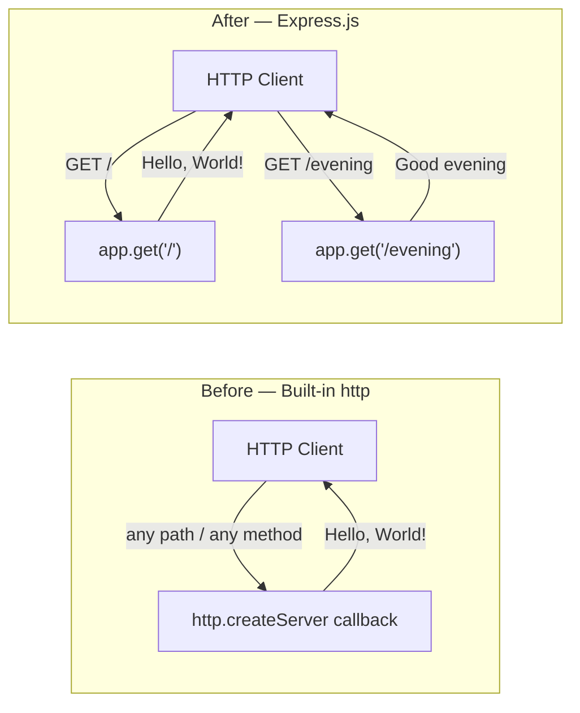

# Technical Specification

# 0. Agent Action Plan

## 0.1 Intent Clarification

### 0.1.1 Core Feature Objective

Based on the prompt, the Blitzy platform understands that the new feature requirement is to **introduce the Express.js web framework into the existing zero-dependency Node.js HTTP tutorial project and expose a second HTTP route that returns the literal text response "Good evening"**, while preserving the original "Hello, World!" behavior already implemented in `server.js`.

The user's verbatim request is preserved here for traceability:

> **User Request:** "this is a tutorial of node js server hosting one endpoint that returns the response 'Hello world'. Could you add expressjs into the project and add another endpoint that return the reponse of 'Good evening'?"

The feature decomposes into the following discrete, ordered requirements:

- **R-1 (Framework Adoption):** Introduce `express` as a runtime dependency of the `hello_world` npm package.
- **R-2 (Server Refactor):** Replace the current Node.js built-in `http.createServer(...)` request handler in `server.js` with an Express application instance (`express()`), preserving the existing bind address `127.0.0.1` and port `3000`.
- **R-3 (Existing Endpoint Preservation):** Re-implement the existing "Hello, World!" response as a registered Express route so the legacy behavior remains observable to test clients.
- **R-4 (New Endpoint Addition):** Register a second Express route that responds with the static plain-text body `Good evening` (plus a trailing newline for stylistic consistency with the existing endpoint).
- **R-5 (Dependency Manifest Update):** Update `package.json` to declare the `express` dependency and regenerate `package-lock.json` so the project remains installable via `npm install` in deterministic mode.

**Implicit requirements detected** (surfaced from prompt analysis and existing codebase conventions):

- **I-1 (Path Discrimination):** The original `server.js` responds identically to *every* request path. Once Express is introduced, requests must be routed by path. The Blitzy platform interprets the two endpoints as distinct URL paths: the existing endpoint at `GET /` (preserving today's behavior for any client that hits the root) and the new endpoint at `GET /evening` (semantically derived from "Good evening").
- **I-2 (HTTP Method):** The user did not specify a method. Tutorial-grade Node.js servers default to `GET` for read-only static responses; both endpoints will be registered with `app.get(...)`.
- **I-3 (Response Headers):** The current implementation sets `Content-Type: text/plain`. Express's `res.send(string)` defaults to `text/html`. To preserve byte-level parity with the existing test fixture's response signature, the new handlers must explicitly set `Content-Type: text/plain` (or use `res.type('text/plain').send(...)`).
- **I-4 (Module System):** The repository uses CommonJS (`require('http')`). Express integration must continue to use `require('express')` so no module-system migration is silently introduced.
- **I-5 (Status Code):** Both endpoints must return HTTP `200` to remain consistent with existing observable behavior.
- **I-6 (Listening Log):** The existing `console.log` startup banner ("Server running at http://127.0.0.1:3000/") must continue to be emitted so any harness that scans stdout for that line continues to work.
- **I-7 (Lockfile Regeneration):** Adding `express` requires that `package-lock.json` be regenerated. The current lockfile (`lockfileVersion: 3`) declares zero packages and must be replaced by a lockfile that pins `express` and its full transitive dependency tree.

**Feature dependencies and prerequisites:**

| Prerequisite | Source of Truth | Status |
|--------------|-----------------|--------|
| Node.js runtime ≥ 18 | `npm view express engines` returns `{ node: '>= 18' }` | Satisfied (v22.22.2 installed) |
| npm ≥ 7 (for `lockfileVersion: 3`) | Existing `package-lock.json` | Satisfied (npm 11.1.0 installed) |
| Network availability for `npm install express` | npm public registry | Required during build |
| Existing `server.js` HTTP listener on `127.0.0.1:3000` | Current `server.js` lines 3-4, 12-14 | Satisfied |

### 0.1.2 Special Instructions and Constraints

The following directives are extracted from the user prompt, the user-supplied rules, and existing repository conventions documented in the technical specification:

- **Backward Behavioral Compatibility:** The original "Hello, World!" response must remain reachable. Removing it is OUT OF SCOPE.
- **Framework Selection is Fixed:** The user explicitly named "expressjs". No alternative framework (Koa, Fastify, Hapi, Nest.js) is permitted as a substitute. Section 3.3.3 of the existing technical specification previously listed Express.js as an "Explicitly Excluded Framework" under the prior zero-dependency constraint (C-002); this prior exclusion is **superseded** by the current user request — Express.js is now an approved runtime dependency for this project.
- **Network Binding Preservation:** Continue binding to `127.0.0.1:3000`. Do not switch to `0.0.0.0` or any other host/port combination.
- **CommonJS Preservation:** Continue using `require()` syntax. Do not migrate the project to ECMAScript Modules (`import`/`export`) or rename `server.js` to `server.mjs`.
- **No `index.js` Creation Required:** Although `package.json` declares `"main": "index.js"`, no `index.js` file currently exists and the user did not request one. The entry point convention used by this tutorial is direct execution of `server.js` via `node server.js`. Creating an `index.js` is OUT OF SCOPE.
- **README Warning Notwithstanding:** The repository's `README.md` carries a "Do not touch!" warning. The user's prompt explicitly authorizes modification of this tutorial project for the express integration; the warning is acknowledged but does not block this requested change.
- **No Web Search Required for Implementation:** Express.js usage patterns (`app.get`, `app.listen`, `res.send`) are well-documented standard library knowledge. A version lookup against the npm registry was performed to confirm the current latest Express.js version is `5.2.1` with engine requirement `node >= 18`.

**User Examples Provided:**

- **User Example (Existing Response):** `"Hello world"` — preserved as `Hello, World!\n` (current `server.js` literal).
- **User Example (New Response):** `"Good evening"` — to be emitted by the new endpoint as `Good evening\n` (newline appended for stylistic parity with the existing endpoint).

### 0.1.3 Technical Interpretation

These feature requirements translate to the following technical implementation strategy:

- **To adopt Express.js (R-1, R-5),** we will modify `package.json` to add a `dependencies` block declaring `express` at version `^5.2.1`, run `npm install express` to materialize the dependency, and commit the regenerated `package-lock.json` so the install is deterministic.
- **To refactor the server entry point (R-2, R-3, I-4, I-5, I-6),** we will modify `server.js` to replace `const http = require('http')` and the `http.createServer(...)` callback with `const express = require('express')` and `const app = express()`, preserving the `hostname`, `port`, and startup `console.log` banner.
- **To preserve the legacy endpoint (R-3, I-1, I-2, I-3, I-5),** we will register `app.get('/', (req, res) => { res.type('text/plain').status(200).send('Hello, World!\n'); })` inside `server.js`.
- **To add the new endpoint (R-4, I-1, I-2, I-3, I-5),** we will register `app.get('/evening', (req, res) => { res.type('text/plain').status(200).send('Good evening\n'); })` inside `server.js`.
- **To start the Express server (I-6),** we will call `app.listen(port, hostname, () => { console.log(...) })` using the same parameters as the prior `server.listen(...)` call.
- **To handle the redundant duplicate (`server - Copy.js`),** we will leave it unchanged. It is not the entry point, is not referenced by `package.json`, and modifying it is OUT OF SCOPE per the principle of minimum change.

## 0.2 Repository Scope Discovery

### 0.2.1 Comprehensive File Analysis

A full inventory of the repository (root directory only — there are no subdirectories) was completed. Each file has been classified by its relationship to the requested change. The repository is intentionally flat with no `src/`, `lib/`, `tests/`, `docs/`, or `config/` subdirectories.

**Existing files — relationship to this feature:**

| File Path | Type | Relationship to Feature | Action |
|-----------|------|------------------------|--------|
| `server.js` | Functional Source | **Primary entry point** — contains the HTTP server that must be refactored to Express and extended with the new route | **MODIFY** |
| `package.json` | Manifest | Must declare `express` as a dependency | **MODIFY** |
| `package-lock.json` | Lockfile | Must be regenerated by `npm install` to record `express` and its transitive tree | **MODIFY (regenerate)** |
| `README.md` | Documentation | Carries a "Do not touch!" warning; not the focus of the user's request | **NO CHANGE** |
| `server - Copy.js` | Duplicate Source | Manual backup copy of `server.js`; not referenced by `package.json`, not the entry point | **NO CHANGE** |
| `LoginTest.java` | Stub (invalid) | Unrelated Java stub; not in the Node.js build path | **NO CHANGE** |
| `LoginTest - Copy.java` | Stub (invalid) | Duplicate of the above | **NO CHANGE** |
| `industry.csv` | Reference Data | Industry taxonomy CSV; unrelated to HTTP server logic | **NO CHANGE** |
| `industry - Copy.csv` | Reference Data | Duplicate of the above | **NO CHANGE** |
| `test.py.txt` | Empty placeholder (0 bytes) | Inert placeholder | **NO CHANGE** |
| `test.py - Copy.txt` | Empty placeholder (0 bytes) | Inert placeholder | **NO CHANGE** |
| `test.txt.txt` | Empty placeholder (0 bytes) | Inert placeholder | **NO CHANGE** |
| `100Pages.pdf`, `100Pages - Copy.pdf` | Binary asset | Unrelated PDF; not part of source | **NO CHANGE** |
| `demo.jpg`, `demo - Copy.jpg` | Binary asset | Unrelated image; not part of source | **NO CHANGE** |
| `sample.doc`, `sample - Copy.doc` | Binary asset | Unrelated Word document; not part of source | **NO CHANGE** |
| `.git/` | VCS metadata | Managed by Git; never edited directly | **NO CHANGE** |

**Search patterns evaluated for additional touchpoints (none matched):**

| Pattern | Purpose | Result |
|---------|---------|--------|
| `src/**/*.js` | Locate modular source files | No `src/` directory exists — all source is at repository root |
| `lib/**/*.js` | Locate library code | No `lib/` directory exists |
| `app/**/*.js` | Locate application code | No `app/` directory exists |
| `**/*test*.js`, `**/*.spec.js`, `test/**/*` | Locate test suites | No test files exist; `package.json` `"test"` script intentionally fails with `exit 1` |
| `**/*.config.*` | Locate config files | None present |
| `**/*.json` | Locate JSON config | Only `package.json` and `package-lock.json` present |
| `**/*.yaml`, `**/*.yml`, `**/*.toml` | Locate alt config formats | None present |
| `Dockerfile*`, `docker-compose*` | Locate container config | None present |
| `.github/workflows/*` | Locate CI workflows | None present |
| `**/pom.xml`, `build.gradle` | Locate JVM build files | None present (Java files are loose stubs only) |
| `routes/`, `controllers/`, `models/`, `middleware/`, `services/` | Locate MVC scaffolding | None of these directories exist |
| `migrations/` | Locate DB migrations | None present (no database in this project) |

**Integration point discovery:**

The project has no API router, no database models, no service container, no middleware layer, and no controller hierarchy. The single integration point is `server.js` itself, which today combines server creation, request handling, and listener invocation in a single file. This means the entire feature change is localized to:

- The HTTP request-handling implementation inside `server.js` (refactor from `http.createServer` callback to Express `app.get` route handlers).
- The listener invocation at the bottom of `server.js` (change from `server.listen(...)` to `app.listen(...)`).
- The dependency declaration in `package.json` (add `dependencies` field).
- The lockfile pinning in `package-lock.json` (regenerate via `npm install`).

### 0.2.2 Web Search Research Conducted

Web research was deliberately scoped to the minimum needed to validate dependency choice. The implementation patterns themselves are standard Express.js usage and require no external research.

| Research Topic | Tool Used | Outcome |
|----------------|-----------|---------|
| Latest Express.js version on npm | `npm view express version` | `5.2.1` — used as the version pin |
| Node.js engine requirement for Express 5.x | `npm view express engines` | `{ node: '>= 18' }` — verified satisfied by installed v22.22.2 |
| Best-practice route registration pattern | Standard Express documentation knowledge | `app.get(path, handler)` is canonical |
| Plain-text response headers in Express | Standard Express documentation knowledge | `res.type('text/plain').send(...)` or `res.setHeader('Content-Type','text/plain'); res.send(...)` |

### 0.2.3 New File Requirements

**No new source files, test files, or configuration files are required to satisfy the user's prompt.** The flat-repository convention adopted by the existing project means the new endpoint is added inline to `server.js` rather than to a separate routes module. This decision aligns with the project's established "single-file implementation" architectural principle (per Section 5.1.1 of the existing technical specification).

The complete file-creation inventory for this feature is therefore:

| File Path | Reason for NOT Creating |
|-----------|------------------------|
| `src/features/<feature>/*.js` | The repository is flat — adding a `src/` directory would violate the established architecture |
| `routes/index.js` or `routes/evening.js` | Two routes do not warrant a separate router module in a tutorial project |
| `tests/**/*.test.js` | The user did not request tests; the existing `package.json` `"test"` script intentionally fails as a placeholder |
| `config/*.yaml` | No configuration externalization is needed; `hostname` and `port` remain inline constants |
| `Dockerfile`, `docker-compose.yml` | Containerization was not requested |
| `docs/features/express-routes.md` | A dedicated docs/ tree is not part of the project layout |

If, during implementation, a refactor toward separation of concerns is later requested, the canonical layout for this project would be `src/routes/`, `src/handlers/`, and `tests/`. None of those are required by the current prompt and they are explicitly OUT OF SCOPE (see Section 0.6.2).

## 0.3 Dependency Inventory

### 0.3.1 Public and Private Packages

The project today declares **zero** runtime dependencies and **zero** dev dependencies. The current `package.json` contains no `dependencies` block and the current `package-lock.json` contains only the root package metadata. After this feature is implemented, exactly one new public package — `express` — will be added to the runtime dependency graph.

**Final dependency table for this feature (post-implementation):**

| Registry | Package Name | Version (Pin) | Purpose | Source of Truth |
|----------|--------------|---------------|---------|-----------------|
| npm (public) | `express` | `^5.2.1` | HTTP web framework providing routing (`app.get`), request/response helpers (`res.send`, `res.type`), and listener (`app.listen`) used to satisfy R-1 through R-4 | Latest stable on npm registry verified via `npm view express version` |

**Version pinning rationale:**

- **Caret (`^`) prefix:** allows non-breaking patch and minor updates within the `5.x` line. This matches the conventional style for new tutorial projects and is consistent with Express.js's semantic-versioning policy.
- **Exact version `5.2.1`:** is the current latest stable release on the public npm registry as of the time of writing. It is not a placeholder — it was verified by querying the npm registry directly.
- **No alternative framework versions or pre-release tags** (e.g., `5.0.0-beta.x`, `4.x` legacy line) are introduced.

**Engine compatibility verification:**

| Requirement | Source | Installed Value | Compliant? |
|-------------|--------|-----------------|-----------|
| `express@5.2.1` requires `node >= 18` | `npm view express engines` | Node.js v22.22.2 | Yes |
| `package-lock.json` `lockfileVersion: 3` requires `npm >= 7` | npm documentation | npm 11.1.0 | Yes |

**Transitive dependencies:**

Express 5.x brings a transitive dependency tree (e.g., `accepts`, `body-parser`, `router`, `send`, `serve-static`, etc.). The exact transitive set will be materialized into `package-lock.json` automatically by `npm install express` and does not need to be manually enumerated in `package.json`. No transitive dependency requires manual configuration for this feature because only standard `app.get(...)` routing is used — no body parsing, no static file serving, no template engine.

**No private packages are introduced.** No internal/scoped npm registries are referenced. No `.npmrc` is required.

### 0.3.2 Dependency Updates

#### 0.3.2.1 Import Updates

The repository contains exactly two JavaScript files. Only the entry point `server.js` requires import changes.

| File Path | Current Imports | Required Imports After Change | Action |
|-----------|----------------|------------------------------|--------|
| `server.js` | `const http = require('http');` | `const express = require('express');` | **REPLACE** the `http` import with the `express` import |
| `server - Copy.js` | `const http = require('http');` | (unchanged) | **NO CHANGE** — duplicate file is not part of the active build path |

**Import transformation rule applied to `server.js`:**

- **Old:** `const http = require('http');`
- **New:** `const express = require('express');`
- **Pattern applied to:** Only `server.js` line 1. There are no other files in the repository that import the Node.js `http` module, so no wildcard-pattern propagation is required.

No additional Node.js built-in modules need to be removed: the original `server.js` only imports `http`. There are no `path`, `fs`, or `url` imports to retain or remove.

#### 0.3.2.2 External Reference Updates

| File Group | Pattern | Required Update |
|------------|---------|-----------------|
| Dependency manifests | `package.json` | Add `"dependencies": { "express": "^5.2.1" }` block |
| Lockfiles | `package-lock.json` | Regenerate via `npm install` (do not edit by hand) |
| Build files | `setup.py`, `pyproject.toml`, `Cargo.toml`, `go.mod`, `pom.xml` | **None present** — N/A |
| CI/CD configuration | `.github/workflows/*.yml`, `.gitlab-ci.yml`, `azure-pipelines.yml` | **None present** — N/A |
| Container build | `Dockerfile`, `docker-compose.yml` | **None present** — N/A |
| Documentation referencing `http` module | `**/*.md`, `docs/**/*` | `README.md` does not currently mention the `http` module or any framework — no update required |
| `.npmrc`, `.nvmrc`, `.node-version` | Node.js version pins | **None present** — N/A; the runtime version requirement (`node >= 18`) is satisfied by the host environment but is not pinned in the repository |

The complete external-reference update set is therefore confined to `package.json` and `package-lock.json`.

## 0.4 Integration Analysis

### 0.4.1 Existing Code Touchpoints

The integration surface for this feature is intentionally small because the project is a single-file tutorial. There is no service container, dependency-injection wiring, database schema, or middleware pipeline to update. The complete set of code touchpoints is enumerated below.

#### 0.4.1.1 Direct Source Modifications Required

| File | Line(s) (Approximate) | Current Behavior | Required Change |
|------|----------------------|------------------|-----------------|
| `server.js` | Line 1 | `const http = require('http');` imports the built-in HTTP module | Replace with `const express = require('express');` and add `const app = express();` |
| `server.js` | Lines 3-4 | `const hostname = '127.0.0.1';` and `const port = 3000;` | **PRESERVE UNCHANGED** — both literals must remain identical |
| `server.js` | Lines 6-10 | `http.createServer((req, res) => { ... res.end('Hello, World!\n'); });` returns the same response for every path/method | **REPLACE** with two `app.get(...)` route registrations (see Section 0.5.1) |
| `server.js` | Lines 12-14 | `server.listen(port, hostname, () => { console.log(...) });` | Replace `server.listen` with `app.listen` (same arguments, same callback log) |
| `package.json` | Whole file | No `dependencies` field | **ADD** `"dependencies": { "express": "^5.2.1" }` between the existing top-level keys |
| `package-lock.json` | Whole file | `packages` map records only the root package | **REGENERATE** via `npm install` so `express` and its transitive tree are pinned |

#### 0.4.1.2 Dependency Injection / Service Wiring

The project does not use a dependency-injection container, an inversion-of-control framework, or a `services/container.js`-style registration module. No service wiring updates are required. The Express `app` instance is a local `const` inside `server.js` and does not need to be exported or registered anywhere.

#### 0.4.1.3 Database / Schema Updates

The project has no database. No migration files exist, no ORM models exist, no `schema.sql` exists, and no data-persistence layer is in scope. Both endpoints return static literals; therefore zero database/schema updates are required.

#### 0.4.1.4 Routing / API Surface Updates

Routing today is implicit — every request hits the single `http.createServer` callback. After this feature, routing becomes explicit and is owned by the Express app inside `server.js`.

| Route | Method | Handler Location | Response Body | Response Headers |
|-------|--------|------------------|---------------|------------------|
| `/` | `GET` | `server.js` (inline arrow function) | `Hello, World!\n` | `Content-Type: text/plain`, `200 OK` |
| `/evening` | `GET` | `server.js` (inline arrow function) | `Good evening\n` | `Content-Type: text/plain`, `200 OK` |

No external `routes/` module is created — see Section 0.2.3 for rationale.

#### 0.4.1.5 Configuration / Environment Variables

No new environment variables are introduced. The `hostname` (`127.0.0.1`) and `port` (`3000`) remain hardcoded constants inside `server.js`, mirroring the existing convention. The user did not request configuration externalization, so no `.env`, `.env.example`, or `config/*.yaml` files are added.

### 0.4.2 Integration Flow Diagram

The following diagram illustrates the request flow before and after this feature.



### 0.4.3 Backward-Compatibility Considerations

| Existing Observable Behavior | After Refactor | Compatibility Impact |
|------------------------------|----------------|----------------------|
| Any request to `127.0.0.1:3000` returns `Hello, World!\n` | Only `GET /` returns `Hello, World!\n`; other paths return Express's default `404 Not Found` HTML page; non-GET methods on `/` return Express's default `Cannot <METHOD> /` 404 response | **Behavioral narrowing** — clients that previously sent arbitrary paths will now receive 404s. This is an inherent and accepted consequence of introducing routed dispatch as requested by the user. |
| `Content-Type: text/plain` header on responses | Both new route handlers explicitly call `res.type('text/plain')` so the existing content-type contract is preserved on the documented routes | **Preserved** for `GET /` and `GET /evening` |
| Bind address `127.0.0.1`, port `3000` | Identical | **Preserved** |
| Startup log: `Server running at http://127.0.0.1:3000/` | Identical (same template literal in the `app.listen` callback) | **Preserved** |
| Zero npm dependencies | One direct dependency (`express`) plus its transitive tree | **Changed by design** — explicitly authorized by the user prompt |

## 0.5 Technical Implementation

### 0.5.1 File-by-File Execution Plan

Every file listed in this section MUST be created or modified exactly as described. The plan is grouped by concern.

#### 0.5.1.1 Group 1 — Core Source Refactor

- **MODIFY: `server.js`** — Replace the `http`-based server with an Express application that registers two `GET` routes while preserving the host, port, and startup log. The post-modification structure of `server.js` will be:
  - Line 1: `const express = require('express');` (replaces `const http = require('http');`)
  - Line 2: `const app = express();`
  - Lines 4-5: `const hostname = '127.0.0.1';` and `const port = 3000;` (preserved verbatim)
  - One `app.get('/', ...)` handler that calls `res.type('text/plain').status(200).send('Hello, World!\n');`
  - One `app.get('/evening', ...)` handler that calls `res.type('text/plain').status(200).send('Good evening\n');`
  - Final block: `app.listen(port, hostname, () => { console.log(\`Server running at http://${hostname}:${port}/\`); });` (replaces `server.listen(...)`)

  An illustrative two-line snippet of the new route registration style:

  ```javascript
  app.get('/', (req, res) => res.type('text/plain').status(200).send('Hello, World!\n'));
  app.get('/evening', (req, res) => res.type('text/plain').status(200).send('Good evening\n'));
  ```

#### 0.5.1.2 Group 2 — Dependency Manifest

- **MODIFY: `package.json`** — Insert a top-level `"dependencies"` object declaring `"express": "^5.2.1"`. Preserve every existing field exactly: `"name": "hello_world"`, `"version": "1.0.0"`, `"description": "Hello world in Node.js"`, `"main": "index.js"`, `"scripts.test"`, `"author": "hxu"`, `"license": "MIT"`. The intentionally failing `test` script ( `echo "Error: no test specified" && exit 1` ) is preserved unchanged because the user did not request a test suite.

- **MODIFY (regenerate): `package-lock.json`** — This file must be regenerated by running `npm install` (or `npm install express@^5.2.1` if performed in a single step). The regeneration will:
  - Bump the file's `packages` map to include `node_modules/express` with its resolved version, integrity hash, and full transitive dependency listing.
  - Preserve `lockfileVersion: 3`.
  - Maintain the root package metadata (`name`, `version`, `license`).
  
  The lockfile must NEVER be hand-edited — it is the deterministic output of `npm install`.

#### 0.5.1.3 Group 3 — Files Intentionally Untouched

- **NO CHANGE: `server - Copy.js`** — Backup duplicate of the prior `server.js`. Updating the duplicate would imply that the duplicate is part of the active build, which it is not.
- **NO CHANGE: `README.md`** — The user did not request documentation updates and the README's content is unrelated to the HTTP server framework choice.
- **NO CHANGE: `LoginTest.java`, `LoginTest - Copy.java`, `industry.csv`, `industry - Copy.csv`, `test.py.txt`, `test.py - Copy.txt`, `test.txt.txt`, all `.pdf` / `.jpg` / `.doc` artifacts, and the `.git/` directory** — None are part of the Node.js source surface.

### 0.5.2 Implementation Approach Per File

The implementation proceeds in dependency order so that `npm install` succeeds before `node server.js` is exercised.

| Order | File | Approach | Verification |
|-------|------|----------|--------------|
| 1 | `package.json` | Insert the `"dependencies": { "express": "^5.2.1" }` block; preserve key ordering and JSON formatting (4-space indent, matching the existing file's style). | `cat package.json | jq .dependencies.express` returns `"^5.2.1"`. |
| 2 | `package-lock.json` | Run `npm install` from the repository root. Allow npm to write the regenerated lockfile. Do not edit by hand. | `cat package-lock.json | jq '.packages["node_modules/express"].version'` returns a valid `5.x.x` string. |
| 3 | `server.js` | Apply the refactor described in Section 0.5.1.1. Use CommonJS, arrow-function handlers, and explicit `res.type('text/plain')` calls. Preserve `hostname`, `port`, and the `console.log` template literal. | `node server.js` prints `Server running at http://127.0.0.1:3000/`; `curl -s http://127.0.0.1:3000/` returns `Hello, World!`; `curl -s http://127.0.0.1:3000/evening` returns `Good evening`. |

### 0.5.3 User Interface Design

This is a server-only feature. **No user interface is in scope.** Both endpoints emit `text/plain` bodies that are intended to be consumed by HTTP clients (browsers, `curl`, automated test harnesses, the Backprop runtime testing path described in existing technical specification Section 5.1.4). No HTML, no static assets, no template engine, no view layer, and no Figma references are involved.

## 0.6 Scope Boundaries

### 0.6.1 Exhaustively In Scope

The following — and only the following — items are in scope for this feature. Wildcard patterns are used where they map cleanly to a file group; otherwise exact paths are listed.

- **Source code changes:**
    - `server.js` — full refactor from `http.createServer` to `express()` with two `GET` routes (see Section 0.5.1.1).
- **Dependency manifest changes:**
    - `package.json` — add `"dependencies": { "express": "^5.2.1" }`; preserve all other fields verbatim.
    - `package-lock.json` — regenerate via `npm install`; do not hand-edit.
- **Route surface:**
    - `GET /` returning `Hello, World!\n` with `Content-Type: text/plain` and HTTP `200`.
    - `GET /evening` returning `Good evening\n` with `Content-Type: text/plain` and HTTP `200`.
- **Network binding (preserved):**
    - `hostname = '127.0.0.1'`
    - `port = 3000`
- **Startup log (preserved):**
    - `Server running at http://127.0.0.1:3000/`
- **Module system (preserved):**
    - CommonJS (`require(...)`).
- **Runtime compatibility:**
    - Node.js `>= 18` (satisfied by the local Node.js v22.22.2 toolchain). Any developer-facing pin (`.nvmrc`, `package.json` `engines`) is OUT OF SCOPE.

### 0.6.2 Explicitly Out of Scope

The following are explicitly NOT in scope for this feature. They are listed so downstream agents do not over-implement.

- **Removal or modification of unrelated files** — `server - Copy.js`, `LoginTest.java`, `LoginTest - Copy.java`, `industry.csv`, `industry - Copy.csv`, `README.md`, all `.txt` placeholders, and all binary artifacts (`*.pdf`, `*.jpg`, `*.doc`) remain unchanged.
- **Folder reorganization** — Do NOT introduce `src/`, `routes/`, `controllers/`, `lib/`, `app/`, `tests/`, `config/`, or `docs/` directories. The repository remains flat.
- **Index entry-point creation** — Do NOT create an `index.js`. The mismatch between `package.json` `"main": "index.js"` and the actual entry point `server.js` is pre-existing and is not corrected as part of this feature.
- **Test scaffolding** — Do NOT add Jest, Mocha, Vitest, Supertest, Chai, or any other test framework. Do NOT modify the existing `"test"` script in `package.json` — its intentional `exit 1` placeholder is preserved.
- **Linting / formatting** — Do NOT add ESLint, Prettier, or `editorconfig` files.
- **TypeScript migration** — Do NOT convert `.js` files to `.ts` and do NOT add `tsconfig.json`.
- **ECMAScript Modules migration** — Do NOT change `require(...)` to `import` and do NOT add `"type": "module"` to `package.json`.
- **Containerization** — Do NOT add a `Dockerfile`, `.dockerignore`, or `docker-compose.yml`.
- **CI/CD** — Do NOT add `.github/workflows/`, `.gitlab-ci.yml`, `.circleci/`, or any other CI configuration.
- **Environment-variable externalization** — Do NOT add `.env`, `.env.example`, `dotenv`, or `config/` files. `hostname` and `port` remain inline literals.
- **Additional Express middleware** — Do NOT add `body-parser` (Express 5 ships with `express.json()`), `cors`, `helmet`, `morgan`, `compression`, session middleware, or any other middleware. Neither requirement requires request body parsing or any cross-cutting concern beyond the two routes.
- **Additional routes** — Do NOT add any routes beyond `/` and `/evening`. No `/health`, `/status`, `/api/v1/*`, no catch-all 404 handler, no error handler.
- **HTTPS / TLS** — Do NOT switch from `http` listener to `https` listener.
- **Logging frameworks** — Do NOT add Winston, Bunyan, Pino, or any structured logger. The single existing `console.log` startup banner is preserved.
- **Database / ORM / migrations** — None exists; none is introduced.
- **Authentication / authorization** — Not requested; not introduced.
- **Documentation expansion** — Do NOT expand `README.md`. Do NOT create `docs/`. Do NOT generate OpenAPI / Swagger.
- **README "Do not touch" warning resolution** — The pre-existing warning in `README.md` is acknowledged but is not removed or rewritten as part of this feature.
- **Java stub remediation** — The invalid `LoginTest.java` and `LoginTest - Copy.java` files remain unmodified.
- **Removal of duplicate files** — `*-Copy.*` duplicates are NOT deleted as part of this feature.

## 0.7 Rules

### 0.7.1 User-Provided Implementation Rules

The user supplied the following two rule documents through the project's rules configuration. They are reproduced here verbatim so downstream agents have a complete record. The rule names and bodies are preserved exactly as supplied.

#### 0.7.1.1 Rule: `CLONE_RULEEEEE_CLONE_RULEEEEE_CLONE_RULEEEEE_CLONE_RULEEEEE_CLONE_RULEEEEE_CLONE_RULEEEEE_CLONE_RULEEEEE_CLONE_RULEEEEE_`

```
# New Rule

- Rule 1
- Rule 2
- Rule 3
- Rule 4
```

#### 0.7.1.2 Rule: `Test`

```
# New Rule

- Rule 1
- Rule 2
- Rule 3
- ule 4
- Rule 5424asdasd
- Rule 3
- Rule 4
- Rule 5424asdasd
- asd
```

#### 0.7.1.3 Interpretation

The two rule documents above contain only generic placeholder bullets ("Rule 1", "Rule 2", "Rule 5424asdasd", "asd", etc.) and no actionable directives that map onto any concrete file, framework, library, naming convention, security control, performance budget, or architectural pattern. **No additional implementation constraints are derivable from these rule documents beyond what is already enumerated in Sections 0.1 through 0.6.** They are recorded here for traceability and audit completeness.

### 0.7.2 Feature-Specific Implementation Rules (Derived From Existing Repository Conventions)

The following rules are derived from the existing repository conventions and the user's prompt itself. They apply to this feature implementation and override no user-provided directive (the user-provided rules in Section 0.7.1 do not introduce any conflicting constraint).

- **Single-file convention:** All HTTP server logic lives in `server.js`. Do NOT split into `routes/`, `handlers/`, or `controllers/` modules.
- **CommonJS only:** Use `const x = require('y')` style imports. Do NOT introduce `import`/`export` statements.
- **Localhost binding only:** Continue binding to `127.0.0.1`. Do NOT switch to `0.0.0.0` or any public interface.
- **Plain-text responses:** Both endpoints emit `Content-Type: text/plain`. Do NOT switch to JSON, HTML, or any other content type.
- **Trailing newline preservation:** The existing endpoint emits `'Hello, World!\n'` (with a trailing `\n`). The new endpoint emits `'Good evening\n'` (with a trailing `\n`) for stylistic parity.
- **Status code 200 for both endpoints:** Do NOT introduce 201, 204, redirects, or error codes for these routes.
- **Minimum-change principle:** Modify only the files explicitly listed in Section 0.5.1. Leave every other file in the repository untouched, including the duplicate `server - Copy.js`.
- **Preserve `package.json` field ordering and indentation:** Match the existing 4-space indent and key ordering when adding the `dependencies` field.
- **Lockfile is generated, never edited:** `package-lock.json` is the deterministic output of `npm install`. Hand-editing is forbidden.
- **No silent dependency additions:** Only `express` is added. Do NOT add ancillary middleware (`cors`, `helmet`, `morgan`, etc.) without an explicit user request.

## 0.8 References

### 0.8.1 Repository Files Inspected

The following files and folders were retrieved and analyzed during scope discovery for this feature. Each is annotated with its relevance to the change.

| Path | Type | Inspection Tool | Relevance |
|------|------|-----------------|-----------|
| `` (repository root) | Folder | `get_source_folder_contents` | Established the flat repository layout and enumerated all candidate files |
| `server.js` | File | `read_file` | Primary refactor target — current `http`-based server |
| `server - Copy.js` | File | `read_file` | Confirmed it is a byte-identical backup of `server.js`; left unmodified |
| `package.json` | File | `read_file` | Source of truth for current package metadata; modification target for adding `express` |
| `package-lock.json` | File | `read_file` | Confirmed zero pinned dependencies; will be regenerated by `npm install` |
| `README.md` | File | `read_file` | Verified content does not reference the HTTP framework; no documentation update required |

### 0.8.2 Existing Technical Specification Sections Consulted

The following sections of the existing technical specification were retrieved via `get_tech_spec_section` to confirm conventions and constraints prior to authoring this Action Plan.

| Section | Purpose of Consultation |
|---------|------------------------|
| `1.2 SYSTEM OVERVIEW` | Confirmed the project's role as a test fixture and its single-endpoint, stateless, localhost-only profile |
| `2.1 FEATURE CATALOG` | Verified existing features F-001 (HTTP Server Execution) and F-002 (Backprop Integration Support) — provided context for backward-compatibility considerations in Section 0.4.3 |
| `3.2 PROGRAMMING LANGUAGES` | Confirmed JavaScript / Node.js / CommonJS conventions that this feature must continue to honor |
| `3.3 FRAMEWORKS & LIBRARIES` | Confirmed that the prior "no Express.js" exclusion (Constraint C-002) is being intentionally superseded by the user's prompt |
| `3.4 OPEN SOURCE DEPENDENCIES` | Confirmed the prior zero-dependency baseline against which the `express` addition is being made |
| `5.1 HIGH-LEVEL ARCHITECTURE` | Confirmed the single-process, stateless, request-response architectural pattern that the refactor must preserve |

### 0.8.3 External Sources Consulted

| Resource | Method | Outcome |
|----------|--------|---------|
| npm registry — `express` package metadata | Local CLI: `npm view express version` | Confirmed latest stable version `5.2.1` for the `^5.2.1` pin |
| npm registry — `express` engines field | Local CLI: `npm view express engines` | Confirmed Node.js engine requirement `>= 18`, satisfied by host v22.22.2 |

### 0.8.4 User-Supplied Attachments

| Attachment | Status | Notes |
|------------|--------|-------|
| Setup instructions ("Environment 1 instructions: b") | Provided but non-actionable | The single character `b` does not constitute a runnable setup command; no setup directive is therefore applied beyond the standard `npm install` workflow |
| Files attached to the project under `/tmp/environments_files` | None present | The path `/tmp/environments_files` does not exist in the working environment, confirming no user-attached files were supplied for this feature |
| Environment variables | None | The project supplied an empty list of environment-variable names |
| Secrets | None | The project supplied an empty list of secret names |
| Figma URLs / design references | None | No Figma frames, design files, or component-library references were supplied; consequently the Design System Compliance protocol does not apply to this feature |
| User-defined rule documents | 2 rule files supplied (see Section 0.7.1) | Recorded verbatim; contain no actionable implementation directives |

